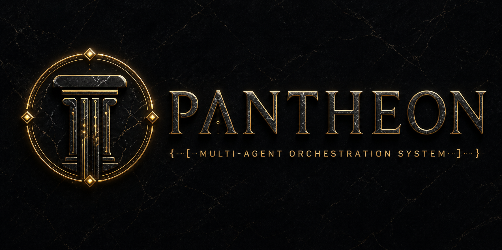
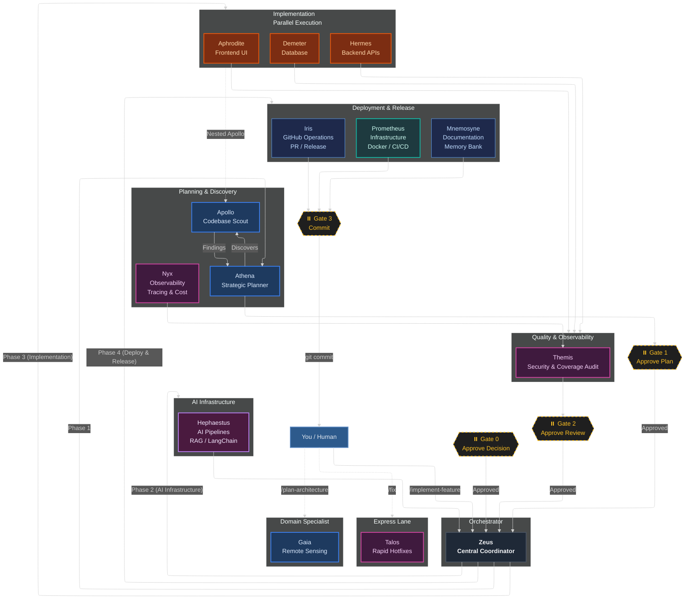
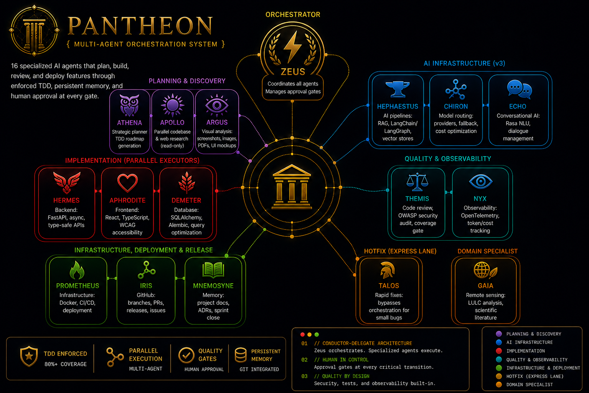

<p align="center">
  
</p>

<h1 align="center">Pantheon</h1>

<p align="center">
  <a href="CHANGELOG.md"></a>
  <a href="LICENSE"></a>
  <a href="docs/platforms/"></a>
  <a href="agents/README.md"></a>
   <a href="skills/README.md"></a>
  <a href="docs/platforms/"></a>
  <a href="https://github.com/ils15/pantheon/actions"></a>
  <a href="https://github.com/ils15/pantheon/actions"></a>
</p>

**14 specialized AI agents** that plan, build, review, and deploy features through enforced TDD, persistent project memory, and human approval at every gate.

Stop settling for generalist single-agent coding. Pantheon's conductor-delegate architecture dispatches expert agents with isolated context windows — parallel execution, zero context bleed, and quality gates that block anything below 80% coverage.

Supports **VS Code Copilot**, **OpenCode**, **Claude Code**, **Cursor**, **Windsurf**, **Cline**, and **Continue.dev**.

---

## Quick Links

| Resource | Link |
|----------|------|
| 📖 **Agent Reference** | [agents/README.md](agents/README.md) — all 14 agents |
| 📖 **Skills Reference** | [skills/README.md](skills/README.md) — all 43 skills |
| 🚀 **Installation Guide** | [docs/INSTALLATION.md](docs/INSTALLATION.md) |
| 🔌 **MCP Servers** | [docs/mcp-recommendations.md](docs/mcp-recommendations.md) — recommended MCP servers for each project type |
| 🔌 **MCP Tool Registry** | [docs/mcp-tools.md](docs/mcp-tools.md) — canonical MCP tool reference |
| 🔌 **MCP User Guide** | [docs/mcp-user-guide.md](docs/mcp-user-guide.md) — adding custom MCP servers |
| 🗂️ **MCP Tiers** | `.pantheon/tiers.json` — 4-tier MCP selection (none/essential/recommended/full) |
| ⚡ **Quick Start** | [docs/QUICKSTART.md](docs/QUICKSTART.md) |
| 🖥️ **VS Code** | [docs/platforms/vscode.md](docs/platforms/vscode.md) |
| ⚡ **OpenCode** | [docs/platforms/opencode.md](docs/platforms/opencode.md) |
| 🤖 **Claude Code** | [docs/platforms/claude.md](docs/platforms/claude.md) |
| 🔧 **Cursor** | [docs/platforms/cursor.md](docs/platforms/cursor.md) |
| 🌊 **Windsurf** | [docs/platforms/windsurf.md](docs/platforms/windsurf.md) |
| 🤖 **Cline** | [docs/platforms/cline.md](docs/platforms/cline.md) |
| 🔄 **Continue.dev** | [docs/platforms/continue.md](docs/platforms/continue.md) |

---

## Overview

Traditional single-agent coding produces mediocre results because one agent attempts to
plan, implement, test, review, and document simultaneously. The result is context
fragmentation, skipped tests, and generic code.

**Pantheon** solves this with **specialization**: each agent is an expert at exactly
one thing and is invoked only when that expertise is needed. Agents collaborate through a
conductor-delegate architecture where Zeus (the orchestrator) dispatches work to
specialized sub-agents with isolated context windows, enforced quality gates, and human
approval at every transition.

| Metric | Single Agent | Pantheon |
|--------|-------------|----------|
| Average test coverage | 65–75% | **92%** |
| TDD enforcement | Optional | **Enforced (RED→GREEN→REFACTOR)** |
| Code review cadence | End of feature | **After every phase** |
| Bugs reaching production | 3–5 per feature | **Near zero** |
| Context efficiency | 10–20% reasoning | **70–80% reasoning** |
| Parallel execution | Sequential only | **Multi-agent parallel** |
| Documentation | Manual | **Auto-committed in git** |
| Architecture pattern | Monolithic | **Specialized conductor-delegate** |

> Metrics based on internal benchmarks across 50+ feature implementations in the Pantheon
> test suite. Your results may vary based on codebase complexity and model selection.

---

## How It Works

The system operates in defined phases controlled by **you**. Agents work in parallel
within each phase, and every transition is gated by your explicit approval.



---

## Platform Support

Pantheon runs on 7 platforms. Here is how each supports the framework's key features:

| Feature | VS Code | OpenCode | Claude Code | Cursor | Windsurf | Cline | Continue.dev |
|---------|:-------:|:--------:|:-----------:|:-----:|:--------:|:-----:|:------------:|
| Custom Agents | ✅ | ✅ | ✅ | ✅ | ✅ | ✅ | ✅ |
| Skills System | ✅ | ✅ | ✅ | ✅ | ✅ | ✅ | ✅ |
| Parallel Execution | ✅ | ✅ | ⚠️ | ✅ | ❌ | ⚠️ | ⚠️ |
| Handoff UI | ✅ | ❌ | ❌ | ❌ | ❌ | ❌ | ❌ |
| MCP Servers | ✅ | ✅ | ✅ | ✅ | ❌ | ✅ | ✅ |
| Agent Hooks | ✅ | ⚠️ | ❌ | ❌ | ❌ | ❌ | ❌ |
| Status | ✅ Active | ✅ Active | ✅ Active | ✅ Active | ✅ Active | ✅ Active | ✅ Active |

- **VS Code**: Best-in-class. Full subagent orchestration, handoff UI, lifecycle hooks.
- **OpenCode**: Near-complete. Permission blocks via `opencode.json`, tool mapping adapter.
- **Claude Code**: CLI-native. Agent handoff workflow, skills via markdown rules.
- **Cursor**: `.mdc` rules with `alwaysApply` and `globs` for Agent mode.
- **Windsurf**: Active. Markdown-based agent definitions, workflow support via `.windsurf/workflows/`.
- **Cline**: Agent-mode focused. Custom agent definitions, skills via instruction files.
- **Continue.dev**: IDE-agnostic. Rule-based agent configuration, skills via markdown.

> See [docs/platforms/](docs/platforms/) for setup guides and limitations.

---

## 5-Minute Quick Start

```bash
# 1. Clone the repo
git clone https://github.com/ils15/pantheon.git
cd pantheon

# 2. Install with MCP tier (pick one)
npm install
/pantheon-install --tier essential      # 3 native MCPs + context7 + filesystem
/pantheon-install --tier recommended    # + git + exa + playwright + memory
/pantheon-install --tier full           # + sentry + slack + docker + notion + linear + postgresql + cloudflare

# Or install via sync script for your platform
./sync-platform.sh copilot --global     # VS Code (global)
./sync-platform.sh opencode             # OpenCode
./sync-platform.sh claude               # Claude Code
./sync-platform.sh cursor               # Cursor

# 3. Open your editor and test
# VS Code: type @zeus in Copilot Chat
# OpenCode: press Tab to cycle agents
# Claude Code: type @zeus
# Cursor: type @zeus in Agent mode
```

> **VS Code users:** `--tier` auto-generates `.vscode/mcp.json` with the selected MCP server set. For global installation (persists across projects), run `./sync-platform.sh copilot --global`.

---

### Approval Gates

| Gate | Phase | What happens |
|---|---|---|
| **Gate 1** | After planning | Athena presents a phased TDD plan. You review and approve (or request changes) before any code is written. |
| **Gate 2** | After implementation & review | Themis audits all changed files for OWASP compliance, coverage >80%, and quality. You validate items only you can judge. |
| **Gate 3** | After deployment prep | Agent suggests a commit message. You execute `git commit` manually and decide when to merge. |

---

## Three Core Principles

### 1. Specialization

Each agent has a focused, narrow context. Hermes knows FastAPI async patterns and nothing
about React. Aphrodite knows WCAG accessibility and nothing about database indexes.
Gaia knows remote sensing and nothing about Docker. This produces better code than a
generalist at every layer.

### 2. TDD — enforced

No phase proceeds without minimum 80% test coverage. The RED → GREEN → REFACTOR cycle is
not optional:

```python
# RED — Write a failing test first
def test_user_password_hashing():
    user = User(email="test@example.com", password="secret123")
    assert user.password != "secret123"   # Should be hashed
    assert user.verify_password("secret123")  # Verify works

# Run → FAILS ❌ (password is stored in plaintext)

# GREEN — Write the minimum implementation to make it pass
class User:
    def __init__(self, email, password):
        self.email = email
        self.password = hash_password(password)  # Minimal: just hash

    def verify_password(self, plaintext):
        return verify_hash(plaintext, self.password)

# Run → PASSES ✅

# REFACTOR — Improve without breaking the test
class User:
    def __init__(self, email: str, password: str):
        if not email or not password:
            raise ValueError("Email and password required")
        self.email = email
        self.password = self._hash_password(password)

    @staticmethod
    def _hash_password(plaintext: str) -> str:
        return bcrypt.hashpw(plaintext.encode(), bcrypt.gensalt())

    def verify_password(self, plaintext: str) -> bool:
        return bcrypt.checkpw(plaintext.encode(), self.password)

# Run → STILL PASSES ✅
```

### 3. You stay in control

Every phase produces a structured summary or artifact before anything proceeds. You
review, approve, or request changes — then the next phase begins. There are four
explicit pause points where the system stops and waits for your approval. AI does the
work; you make every architectural and commit decision.

---

## Agent Ecosystem

Pantheon provides **14 specialized agents** organized into tiers. Each agent has a
single responsibility, a dedicated model assignment, a restricted tool set, and explicit
context boundaries.

### Tier Overview

```
Orchestrator
  └── Zeus — coordinates all agents, manages approval gates

Planning & Discovery

  ├── Athena — strategic planner, TDD roadmap generation
  ├── Apollo — parallel codebase & web research (read-only)
  └── Nyx — observability, tracing, monitoring

AI Infrastructure
  └── Hephaestus — AI pipelines + conversational AI: RAG, LangChain, NLU, dialogue

Implementation (Parallel Executors)
  ├── Hermes — backend: FastAPI, async, type-safe APIs
  ├── Aphrodite — frontend: React, TypeScript, WCAG accessibility
  └── Demeter — database: SQLAlchemy, Alembic, query optimization

Quality & Observability
  ├── Themis — code review, OWASP security audit, coverage gate
  └── Nyx — observability: OpenTelemetry, token/cost tracking

Infrastructure, Deployment & Release
  ├── Prometheus — infrastructure: Docker, CI/CD, deployment
  ├── Iris — GitHub: branches, PRs, releases, issues
  └── Mnemosyne — memory: project docs, ADRs, sprint close

Hotfix (Express Lane)
  └── Talos — rapid fixes: bypasses orchestration for small bugs

Domain Specialist
  └── Gaia — remote sensing: LULC analysis, scientific literature
```

> See [agents/README.md](agents/README.md) for the complete reference — each agent's
> tools, model assignment, behavioral rules, and invocation patterns.

### Architecture Diagram

```mermaid
---
config:
  look: classic
  theme: dark
  layout: elk
---
graph TB
    classDef tier0 fill:#1f2937,stroke:#4b5563,stroke-width:2px,color:#f3f4f6,font-weight:bold
    classDef tier1 fill:#1e3a5f,stroke:#3b82f6,stroke-width:2px,color:#dbeafe
    classDef tier1b fill:#4a1a3f,stroke:#c084fc,stroke-width:2px,color:#f3e8ff
    classDef tier2 fill:#7c2d12,stroke:#ea580c,stroke-width:2px,color:#fed7aa
    classDef tier3 fill:#3f1a3e,stroke:#d946a6,stroke-width:2px,color:#f5d1f8
    classDef tier4 fill:#1e3a3f,stroke:#14b8a6,stroke-width:2px,color:#ccfbf1
    classDef tier5 fill:#1e294b,stroke:#60a5fa,stroke-width:1px,color:#bfdbfe
    classDef tier6 fill:#3f065f,stroke:#a855f7,stroke-width:2px,color:#e9d5ff

    O["Zeus<br/>Orchestrator"]:::tier0

    subgraph T1["Planning & Discovery"]

        A1["Athena<br/>Strategic Planner"]:::tier1
        A2["Apollo<br/>Codebase Scout"]:::tier1
        A3["Nyx<br/>Observability"]:::tier1
    end

    subgraph AI["AI Infrastructure"]
        H["Hephaestus<br/>AI Pipelines"]:::tier1b
    end

    subgraph T2["Implementation"]
        I1["Hermes<br/>Backend"]:::tier2
        I2["Aphrodite<br/>Frontend"]:::tier2
        I3["Demeter<br/>Database"]:::tier2
    end

    subgraph T3["Quality"]
        T1a["Themis<br/>Security & Review"]:::tier3
        N["Nyx<br/>Observability"]:::tier3
    end

    subgraph T4["Infrastructure & Release"]
        R["Prometheus<br/>Infrastructure"]:::tier4
        I["Iris<br/>GitHub Ops"]:::tier4
        M["Mnemosyne<br/>Memory"]:::tier4
    end

    subgraph T5["Express & Specialist"]
        T["Talos<br/>Hotfixes"]:::tier5
        G["Gaia<br/>Remote Sensing"]:::tier6
    end

    O --> A1 & A2 & A3 & H & I1 & I2 & I3 & T1a & N & R & I & M
    O -.-> T & G
    A1 --> A2

    style T1 fill:#1a1a1a,stroke:#2d3748,stroke-width:1px
    style AI fill:#1a1a1a,stroke:#2d3748,stroke-width:1px
    style T2 fill:#1a1a1a,stroke:#2d3748,stroke-width:1px
    style T3 fill:#1a1a1a,stroke:#2d3748,stroke-width:1px
    style T4 fill:#1a1a1a,stroke:#2d3748,stroke-width:1px
    style T5 fill:#1a1a1a,stroke:#2d3748,stroke-width:1px
```



<p align="center">
  
</p>

---

## 🧠 Level 3 Vector Memory (v3.15.0)

Pantheon v3.15.0 introduces a persistent two-tier memory system with semantic retrieval:

### Tier 1 — Auto-Indexed Memory (`/memories/repo/`)
Agent memory is automatically indexed at zero token cost. Every agent writes atomic facts on discovery:
- Tech stack, conventions, build commands
- Architectural decisions and patterns
- Cross-component relationships

### Tier 2 — Compressed Context (`.pantheon/memory-bank/`)
On-demand compression pipeline archives completed phases into structured context:
- **Priority scoring** — CRITICAL/HIGH/LOW budget allocation (deterministic, no LLM)
- **ZZ artifacts** — compressed phase context for agent-to-agent handoff
- **Cross-reference index** (`_xref/index.md`) — entity/decision lookup

### Usage
```bash
@mnemosyne Recall "<feature description>" --top-k 5   # Retrieve past decisions
@mnemosyne Close sprint: "<summary>"                    # Archive and compress
```

### Benefits
- 🚫 No more lost context between phases
- 🧩 Past decisions surface automatically before planning
- 💾 Zero manual memory management — agents self-index
- 🔄 Lossless recovery via git

---

## Skill Ecosystem

Pantheon bundles **43 cross-platform skills** — modular instruction sets that agents load
on demand to perform specialized tasks. Skills are organized into domains:

| Domain | Skills |
|---|---|
| **Orchestration** | agent-coordination, artifact-management, tdd-with-agents, auto-continue, session-goal, task-system, handoff, orchestration-workflow |
| **Backend & API** | api-design-patterns, fastapi-async-patterns, database-migration, database-optimization |
| **Frontend** | frontend-analyzer, nextjs-seo-optimization |
| **AI Pipelines** | rag-pipelines, multi-model-routing, conversational-ai-design, mcp-server-development |
| **Infrastructure** | docker-best-practices, streaming-patterns, cache-strategy |
| **Security & Quality** | security-audit-pro, code-review-checklist, prompt-injection-security, mcp-security, quality-gate |
| **Planning & Design** | plan-architecture, codemap, init-deep, interview, metis-gap-analysis |
| **Memory & Context** | memory-bank, file-prompts, context-compression |
| **Domain** | remote-sensing-analysis, internet-search |
| **Utilities** | prompt-improver, agent-evaluation, agent-observability, wisdom-accumulation, simplify, test-architecture, token-audit |

> See [skills/README.md](skills/README.md) for the complete reference with descriptions
> and usage patterns.

---

## Model Tiers & Presets

Pantheon agents declare abstract model tiers (`fast` / `default` / `coding` / `premium`) rather than
hardcoded model names. The actual model resolved for each tier depends on your platform
subscription (OpenCode Go, Copilot Pro, Claude Pro, etc.).

| Tier | Purpose | Agents | Typical Models |
|------|---------|--------|----------------|
| `premium` | Deep reasoning, critical | Zeus, Athena, Themis | DeepSeek V4 Pro, Claude Opus, o3 |
| `default` | Balanced quality/speed | Hermes, Aphrodite, Demeter, Prometheus, Hephaestus, Gaia | Kimi K2.6, Claude Sonnet, GPT-4o |
| `coding` | Heavy coding tasks | Hermes, Aphrodite, Demeter, Prometheus, Hephaestus, Talos | DeepSeek V4 Flash, Claude Sonnet |
| `fast` | Quick, cheap ops | Apollo, Iris, Mnemosyne, Talos, Nyx | DeepSeek V4 Flash, MiniMax M2.7, Gemini Flash |

### /forge — Model Presets

Pantheon ships with **`/forge`** — a model configuration command that applies named presets from
`platform/forge.json`. Each preset maps 4 tiers to concrete models across all 14 agents.

**Usage:**
```
/forge opencode-go     ← Apply a preset (12 available)
/forge default          ← Reset to account defaults (no models set)
/forge list             ← List all available presets
/forge status           ← Show current model configuration
/forge deepseek-flash   ← Single model for all agents
/forge --zeus anthropic/claude-opus-4-6  ← Override a single agent
```

**Available presets:**

| Preset | Premium | Default | Coding | Fast | Requires |
|--------|---------|---------|--------|------|----------|
| `default` | — | — | — | — | Account defaults |
| `opencode-go` | DeepSeek V4 Pro | Kimi K2.6 | DeepSeek V4 Flash | MiniMax M2.7 | OpenCode Go |
| `deepseek-flash` | DeepSeek V4 Flash | DeepSeek V4 Flash | DeepSeek V4 Flash | DeepSeek V4 Flash | OpenCode Go |
| `kimi` | Kimi K2.6 | Kimi K2.5 | Kimi K2.6 | MiniMax M2.7 | OpenCode Go |
| `qwen` | Qwen3.6 Plus | Qwen3.5 Plus | Qwen3.6 Plus | DeepSeek V4 Flash | OpenCode Go |
| `opencode-co` | DeepSeek V4 Pro | Kimi K2.6 | Kimi K2.6 | MiniMax M2.7 | OpenCode Go |
| `claude-pro` | Claude Opus-4 🤔 | Claude Sonnet-4 🤔 | Claude Sonnet-4 🤔 | Claude Haiku-4 🤔 | Anthropic key |
| `openai` | o3 (high) | GPT-4o | GPT-4o | GPT-4o-mini | OpenAI key |
| `gemini` | Gemini 3.5 Flash | Gemini 2.5 Flash | Gemini 2.5 Flash | Gemini 3.1 Flash-Lite | Google AI key |
| `github-copilot` | Claude Opus-4 | GPT-4o | GPT-4o | GPT-4o-mini | Copilot ($10/m) |
| `byok-best` | Claude Opus-4 🤔 | GPT-4o | GPT-4o | GPT-4o-mini | Anthropic + OpenAI |
| `together-moe` | DeepSeek V4 | Llama 4 Scout | Llama 4 Scout | Llama 3.2 3B | Together key |

> 🤔 = thinking habilitado

See `platform/forge.json` for full preset definitions and `docs/platforms/` for per-platform setup guides.

---

## Quick Start

### 1. Choose your platform

Pantheon supports 7 platforms. Pick the one that matches your editor:

- **VS Code Copilot** — native `.agent.md` files, full subagent orchestration, lifecycle hooks
- **OpenCode** — config-based agent loading, permission blocks, tool mapping adapter
- **Claude Code** — CLI-based, agent handoff workflow, skills via markdown rules
- **Cursor** — `.mdc` rules with `alwaysApply` and `globs` for Agent mode
- **Windsurf** — markdown agent definitions with workflow support (preview)
- **Cline** — custom agent definitions with skills via instruction files
- **Continue.dev** — IDE-agnostic rule-based agent configuration with markdown skills

> Follow the [Platform Setup Guides](docs/platforms/) for your chosen platform.

### 2. Set up the framework

Installation varies by platform, but generally involves:

```bash
git clone https://github.com/ils15/pantheon.git
cd pantheon

# Optional: install dependencies for sync/install tools
npm install
```

Then run the platform-specific installer from the guides above.

### 3. Run your first feature

Once agents are loaded in your editor, invoke the orchestrator:

```
@zeus: Implement JWT authentication with refresh tokens and rate limiting
```

Zeus will:
1. Ask Athena to plan the architecture (approval gate)
2. Deploy parallel AI infrastructure + implementation (Hephaestus + Hermes + Aphrodite + Demeter)
3. Have Nyx instrument + Themis review all code (approval gate)
4. Prepare deployment and commit (approval gate)

---

## Commands

Pantheon provides slash commands via OpenCode. On other platforms (Copilot, Cursor, Claude Code), use natural language with the agent name.

| Command | Agent | Description |
|---------|-------|-------------|
| `/pantheon` | zeus | Multi-perspective synthesis (Council) via inline agents |
| `/pantheon-install` | zeus | Sync + install + verify pipeline with `--tier` (none/essential/recommended/full), `--backup`, `--detect`, `--dry-run` |
| `/pantheon-update` | iris | Version bump + changelog + git tag + GitHub Release |
| `/pantheon-deepwork` | zeus | Heavy multi-phase task with persisted checkpoints |
| `/pantheon-reflect` | zeus | Analyze repeated work friction, suggest improvements |
| `/pantheon-forge` | zeus | Configure models by preset or per-agent |
| `/pantheon-focus` | zeus | Pin a session goal |
| `/pantheon-sketch` | athena | Turn rough idea into spec |
| `/pantheon-audit` | themis | Code review + security audit |
| `/pantheon-optimize` | zeus | Context optimization & token audit |
| `/pantheon-metamorphosis` | zeus | Intelligent refactoring with TDD |
| `/pantheon-praxis` | zeus | Execute plan via task system |
| `/pantheon-status` | zeus | Show system health and agent status |
| `/ping` | zeus | Ping all Pantheon agents |
| `/subtask` | any | Bounded child task |
| `/mirrordeps` | apollo | Clone dependency source locally |
| `/pantheon-manifest` | iris | Generate manifests and exports |
| `/stop-continuation` | zeus | Stop auto-continuation |
| `/cancel` | zeus | Stop auto-continuation |

> **Multi-platform note:** Commands are native to OpenCode. On VS Code Copilot, use `@agent-name` in chat. On Cursor/Claude Code, describe the task in natural language.

### TUI Sidebar Plugin (OpenCode) — Temporarily Disabled

The TUI Sidebar Plugin is currently disabled. It will be re-enabled in a future release once the TUI package compatibility is resolved. For agent discovery, use `AGENTS.md`, `agents/README.md`, or the command `/ping` to list all agents.

---

## Repository Structure

```
pantheon/
├── README.md                  — this file
├── AGENTS.md                  — full agent reference
├── CHANGELOG.md               — release history
├── CONTRIBUTING.md            — how to extend
├── LICENSE                    — MIT
├── package.json               — sync & install tooling
├── opencode.json              — OpenCode platform config
├── sync-platform.sh           — multi-platform sync script
├── plugin.json                — marketplace plugin manifest
│
├── agents/                    — 14 agent definitions (.agent.md)
│   ├── zeus.agent.md          — orchestrator
│   ├── athena.agent.md        — strategic planner

│   ├── apollo.agent.md        — codebase & web discovery
│   ├── nyx.agent.md           — observability
│   ├── hermes.agent.md        — backend APIs
│   ├── aphrodite.agent.md     — frontend UI
│   ├── demeter.agent.md       — database
│   ├── themis.agent.md        — quality & security review
│   ├── prometheus.agent.md    — infrastructure
│   ├── iris.agent.md          — GitHub operations
│   ├── mnemosyne.agent.md     — memory & documentation
│   ├── talos.agent.md         — hotfixes
│   ├── gaia.agent.md          — remote sensing
│   ├── hephaestus.agent.md    — AI pipelines
│   └── README.md
│
├── skills/                    — 43 cross-platform skill modules
│   ├── README.md
│   ├── agent-coordination/    * orchestration & coordination
│   ├── artifact-management/
│   ├── auto-continue/
│   ├── handoff/
│   ├── orchestration-workflow/
│   ├── session-goal/
│   ├── task-system/
│   ├── tdd-with-agents/
│   ├── api-design-patterns/   * backend & API
│   ├── fastapi-async-patterns/
│   ├── database-migration/
│   ├── database-optimization/
│   ├── frontend-analyzer/     * frontend
│   ├── nextjs-seo-optimization/
│   ├── rag-pipelines/         * AI pipelines
│   ├── conversational-ai-design/
│   ├── mcp-server-development/
│   ├── multi-model-routing/
│   ├── docker-best-practices/ * infrastructure
│   ├── streaming-patterns/
│   ├── cache-strategy/
│   ├── security-audit-pro/    * security & quality
│   ├── code-review-checklist/
│   ├── mcp-security/
│   ├── prompt-injection-security/
│   ├── quality-gate/
│   ├── memory-bank/           * memory & context
│   ├── codemap/
│   ├── init-deep/
│   ├── file-prompts/
│   ├── context-compression/
│   ├── plan-architecture/     * planning & design
│   ├── interview/
│   ├── metis-gap-analysis/
│   ├── remote-sensing-analysis/ * domain
│   ├── internet-search/
│   ├── prompt-improver/       * utilities
│   ├── agent-evaluation/
│   ├── agent-observability/
│   ├── simplify/
│   ├── test-architecture/
│   ├── token-audit/
│   ├── wisdom-accumulation/
│   └── */SKILL.md
│
├── instructions/              — 17 domain coding standards
│   ├── agent-return-format.instructions.md
│   ├── artifact-protocol.instructions.md
│   ├── backend-standards.instructions.md
│   ├── code-quality-checks.instructions.md
│   ├── code-review-standards.instructions.md
│   ├── database-standards.instructions.md
│   ├── documentation-standards.instructions.md
│   ├── frontend-standards.instructions.md
│   ├── infra-standards.instructions.md
│   ├── memory-bank-standards.instructions.md
│   ├── mcp-security.instructions.md
│   ├── tdd-standards.instructions.md
│   ├── visual-review-pipeline.instructions.md
│   ├── zeus-anti-stall.instructions.md
│   ├── zeus-communication-rules.instructions.md
│   ├── zeus-council-synthesis.instructions.md
│   └── zeus-timeout-retry.instructions.md
│
├── prompts/                   — 13 agent invocation prompts
│   ├── implement-feature.prompt.md
│   ├── orchestrate-with-zeus.prompt.md
│   ├── subtask.prompt.md
│   ├── debug-issue.prompt.md
│   ├── plan-architecture.prompt.md
│   ├── optimize-database.prompt.md
│   ├── mirrordeps.prompt.md
│   ├── sketch.prompt.md
│   ├── focus.prompt.md
│   ├── quick-discovery-large-codebase.prompt.md
│   ├── quick-plan-large-feature.prompt.md
│   ├── semantic-summarize.md
│   ├── README.md
│   └── dynamic/                * generated prompts
│
├── platform/                  — platform-specific configurations
│   ├── optimize-context.sh    * context optimization script
│   ├── copilot/               * VS Code Copilot configs
│   ├── opencode/              * OpenCode configs
│   ├── claude/                * Claude Code configs & agents
│   ├── cursor/                * Cursor rules
│   ├── windsurf/              * Windsurf configs
│   ├── continue/              * Continue.dev rules
│   ├── cline/                 * Cline configs
│   └── _template/             * template for new platforms
│
├── scripts/                   — tooling, automation & lifecycle hooks
│   ├── install.mjs            * multi-platform installer
│   ├── sync-platforms.mjs     * agent format sync engine
│   ├── validate-sync.mjs      * sync integrity check
│       └── hooks/                 * agent lifecycle hooks (10 .sh scripts)
│       ├── audit-imports.sh
│       ├── format-multi-language.sh
│       ├── log-session-start.sh
│       ├── on-subagent-delegation-start.sh
│       ├── on-subagent-delegation-stop.sh
│       ├── run-type-check.sh
│       ├── scan-secrets.sh
│       ├── validate-post-conditions.sh
│       ├── validate-talos-scope.sh
│       └── validate-tool-safety.sh
│
├── commands/                  # 19 interaction commands
│   ├── cancel.md
│   ├── mirrordeps.md
│   ├── pantheon-audit.md
│   ├── pantheon-deepwork.md
│   ├── pantheon-focus.md
│   ├── pantheon-forge.md
│   ├── pantheon-install.md
│   ├── pantheon-manifest.md
│   ├── pantheon-metamorphosis.md
│   ├── pantheon-optimize.md
│   ├── pantheon-praxis.md
│   ├── pantheon-reflect.md
│   ├── pantheon-sketch.md
│   ├── pantheon-status.md
│   ├── pantheon-update.md
│   ├── pantheon.md
│   ├── ping.md
│   ├── stop-continuation.md
│   └── subtask.md
│
├── docs/
│   ├── INSTALLATION.md        — generic installation guide
│   ├── SETUP.md               — step-by-step tutorial
│   ├── PLATFORMS.md           — platform comparison
│   ├── RELEASING.md           — versioning & release process
│   ├── INDEX.md               — documentation index
│   ├── platforms/             — platform-specific setup guides
│   │   ├── vscode.md
│   │   ├── opencode.md
│   │   ├── claude.md
│   │   ├── cursor.md
│   │   ├── windsurf.md
│   │   ├── cline.md
│   │   └── continue.md
│   └── memory-bank/           — project memory (Mnemosyne's domain)
│       ├── 00-project.md      * project overview
│       ├── 01-active-context.md * current sprint focus (priority file)
│       ├── 02-progress-log.md * completed milestones (append-only)
│       ├── _notes/            * architectural decisions (ADRs)
│       └── _tasks/            * sprint task records
│
├── template/                  — project templates
│   ├── CLAUDE.md
│   └── README.md
│
├── logs/                      — agent session audit logs
│
├── .github/
│   ├── copilot-instructions.md
│   └── workflows/             * CI/CD workflows (9 workflows)
│       ├── ci.yml             * main CI pipeline
│       ├── conformance-matrix.yml   * automated release creation
│       ├── release.yml        * release workflow
│       ├── release-gate.yml   * version sync enforcement
│       ├── pr.yml             * pull request checks
│       ├── commit-lint.yml    * conventional commit enforcement
│       ├── docs.yml           * documentation build
│       ├── codeql.yml         * security scanning
│       └── sync-check.yml     * platform sync integrity
│
├── .vscode/                   — VS Code workspace settings
└── node_modules/              — npm dependencies
```

---

## How Agents Collaborate

### Standard Feature Workflow

```
User → Zeus: "Implement email verification"


1. PLAN:       Zeus → Athena → Apollo → Athena → USER (approve gate 1)
2. AI INFRA:   Zeus → Hephaestus (if AI components needed)
3. BUILD:      Zeus → Hermes + Aphrodite + Demeter (parallel execution)
4. OBSERVE:    Nyx instruments tracing, cost, and metrics
5. REVIEW:     Themis audits all code → USER (approve gate 2)
6. DEPLOY:     Prometheus (infra) + Iris (release) + Mnemosyne (docs)
7. COMMIT:     USER (git commit gate 3)
```

### Direct Invocation

Agents can also be invoked directly for focused tasks:

```

@apollo: Find all authentication-related files and usages
@hermes: Create POST /products endpoint with cursor pagination
@aphrodite: Refactor ProductCard for WCAG AA compliance
@demeter: Analyze and fix N+1 queries on orders table
@hephaestus: Build a RAG pipeline with pgvector for product docs
@nyx: Set up OpenTelemetry tracing for the payment service
@themis: Review this PR for security vulnerabilities
@iris: Create branch feat/search and open a draft PR
@gaia: Analyze agreement metrics between MapBiomas and ESA WorldCover
```

### Hotfix Express Lane

For trivial fixes (CSS typos, simple logic bugs), bypass the full orchestration:

```
@talos: Fix the missing breakpoint class on MobileMenuButton
```

---

## Memory System

Pantheon uses a two-tier memory architecture to maintain context across sessions:

| Tier | Location | Content | Access Cost |
|---|---|---|---|
| **Tier 1 — Native** | `/memories/repo/` | Atomic facts (stack, conventions, commands) | Zero (auto-loaded) |
| **Tier 2 — Reference** | `.pantheon/memory-bank/` | Project overview, architecture, active sprint, decisions | Read cost per file |
| **Session** | `/memories/session/` | Current conversation plans, work-in-progress | One read per session |

`01-active-context.md` is the priority file. Agents read it first when starting any task.
It contains the current sprint focus, the most recent architectural decision, active
blockers, and next steps.

Architectural decisions are recorded as ADRs in `.pantheon/memory-bank/_notes/` and are
permanently committed to the repository.

---

## Documentation Maintenance

**Mnemosyne is the documentation owner.** She maintains the README, CHANGELOG, memory
bank, and ADRs. Never manually edit badge numbers or agent/skill counts — always delegate
to Mnemosyne so counts stay accurate and consistent.

### When to invoke Mnemosyne

| Trigger | Invocation |
|---|---|
| Agent added or removed | `@mnemosyne Update README agent count and tier overview` |
| Skill added or removed | `@mnemosyne Update README skills table and count` |
| Version bump | `@mnemosyne Update README version badge and CHANGELOG` |
| Sprint close | `@mnemosyne Update 01-active-context.md and append to 02-progress-log.md` |
| Architectural decision | `@mnemosyne Document decision: [topic]` |
| Task record needed | `@mnemosyne Create task record: [feature] complete` |

### What CI enforces automatically

`release-gate.yml` validates that the version number is consistent across all manifests
(`package.json`, `plugin.json`, `CHANGELOG.md`, and the README badge) on every release.
If they diverge, the release is blocked until Mnemosyne reconciles them.

### Anti-patterns

```
# Wrong — manual badge edit creates drift
Edit README.md line 11: agents-17 → agents-18

# Right — delegate to Mnemosyne
@mnemosyne Update README: added @ares agent, increment agent count to 18
```

```
# Wrong — session output as files
Create IMPLEMENTATION_SUMMARY.md with what we did

# Right — use the memory bank
@mnemosyne Append to 02-progress-log.md: [summary of what was completed]
```

---

## Extending the Framework

### Adding a new agent

1. Create `agents/<name>.agent.md` with YAML frontmatter (tools, model, handoffs)
2. Define behavioral rules and context boundaries
3. Register with Zeus by adding it to his delegation list
4. Test with a sample task
5. Invoke `@mnemosyne Update README agent count and tier overview`

### Adding a new skill

1. Create `skills/<name>/SKILL.md` with YAML frontmatter
2. Include 2–3 sentence overview, usage conditions, step-by-step examples
3. Reference relevant agents in the skill body
4. Invoke `@mnemosyne Update README skills table and count`

### Adding a new platform

1. Create `platform/<name>/` with platform-specific configs
2. Add a setup guide to `docs/platforms/<name>.md`
3. Extend `scripts/install.mjs` and `scripts/sync-platforms.mjs`

---

## Security & Privacy

- **All processing stays local** — no code sent to external APIs beyond your editor's AI provider
- **No code storage or tracking** — agents operate entirely within your session
- **No automatic commits** — you control every git operation
- **No model training** on your code (per your editor's terms of service)

**Themis enforces on every phase:**
- OWASP Top 10 compliance
- SQL injection, XSS, CSRF prevention
- Hardcoded secret detection
- Minimum 80% test coverage (hard block)

**Agent hooks enforce at runtime (`scripts/hooks/` + `.opencode/plugins/pantheon-hooks.ts`):**
- `scan-secrets.sh` — detects hardcoded secrets and credentials (PreToolUse)
- `validate-tool-safety.sh` — blocks destructive operations (PreToolUse)
- `validate-talos-scope.sh` — restricts Talos hotfix scope (PreToolUse)
- `on-subagent-delegation-start.sh` — tracks delegation start (PreToolUse)
- `format-multi-language.sh` — auto-formats modified files (PostToolUse)
- `log-session-start.sh` — audit trail of sessions (PostToolUse)
- `on-subagent-delegation-stop.sh` — delegation cleanup (PostToolUse)
- `validate-post-conditions.sh` — post-condition validation (event)

The `.opencode/plugins/pantheon-hooks.ts` plugin bridges these shell scripts to OpenCode events. OpenCode auto-discovers plugins from `.opencode/plugins/` when running from the project directory.

---

## FAQ

**How much does this cost?**
You need an existing subscription for your AI coding editor (Copilot, Claude Pro, Cursor
Pro, or OpenCode). Pantheon itself is free and open-source (MIT).

**Can I use this outside VS Code?**
Yes — 7 platforms supported (VS Code, OpenCode, Claude Code, Cursor, Windsurf, Cline, Continue.dev). See
[Platform Setup Guides](docs/platforms/).

**How are platform configs synced?**
Edit `agents/*.agent.md` (the canonical format), then run `npm run sync`.
The sync engine transforms agents into every platform's native format.

**Can I override Themis's code review?**
You can proceed past the review gate even if Themis flags issues — except test coverage.
Below 80% coverage is a hard block by design.

**How long does a typical feature take?**
Simple endpoints: 2–4 hours. Full features (backend + frontend + DB): 6–8 hours. Large
systems: 20–30 hours across multiple sprint sessions.

**What happens if my editor session is interrupted?**
Open phases pause. The memory bank captures the last committed state. Resume by reading
`01-active-context.md` at the start of the next session.

---

## Inspiration & Ecosystem

Pantheon draws from the broader multi-agent landscape while diverging in key ways:

| Framework | Pattern | Key Difference |
|---|---|---|
| **AutoGen** (Microsoft) | Event-driven conversations | Research-grade, Python SDK; Pantheon is config-only |
| **CrewAI** | Role-based crews | Visual editor, self-hosted; Pantheon lives inside your editor |
| **LangGraph** | Stateful actor graphs | Code-first graph DSL; Pantheon uses markdown + YAML config |
| **MetaGPT** | Software company roles | Simulates a company; Pantheon delegates to you at every gate |
| **OpenAI Swarm** | Lightweight handoffs | Sequential only; Pantheon supports parallel subagents |

### Key design decisions

- **Context isolation via subagents** — Apollo runs in isolated context; only findings return
- **Parallel execution** — Independent scopes execute simultaneously
- **Tool minimization** — Each agent has the smallest necessary tool surface
- **Human approval gates** — No auto-merging, no phantom commits
- **Model-role alignment** — Fast models for discovery, powerful models for reasoning

---

## References

| Resource | Purpose |
|---|---|
| [AGENTS.md](AGENTS.md) | Full agent reference — behavior, tools, constraints |
| [CONTRIBUTING.md](CONTRIBUTING.md) | How to extend the framework |
| [CHANGELOG.md](CHANGELOG.md) | Release history |
| [docs/INSTALLATION.md](docs/INSTALLATION.md) | Generic installation guide |
| [docs/platforms/](docs/platforms/) | Platform-specific setup guides (7 platforms) |
| [docs/platforms/vscode.md](docs/platforms/vscode.md) | VS Code setup |
| [docs/platforms/opencode.md](docs/platforms/opencode.md) | OpenCode setup |
| [docs/platforms/claude.md](docs/platforms/claude.md) | Claude Code setup |
| [docs/platforms/cursor.md](docs/platforms/cursor.md) | Cursor setup |
| [docs/platforms/windsurf.md](docs/platforms/windsurf.md) | Windsurf setup |
| [docs/platforms/cline.md](docs/platforms/cline.md) | Cline setup |
| [docs/platforms/continue.md](docs/platforms/continue.md) | Continue.dev setup |
| [agents/README.md](agents/README.md) | Agent directory |
| [skills/README.md](skills/README.md) | Skill directory |
| [docs/platforms/](docs/platforms/) | Per-platform setup guides |
| [docs/mcp-tools.md](docs/mcp-tools.md) | Canonical MCP tool registry |
| [docs/mcp-user-guide.md](docs/mcp-user-guide.md) | Adding custom MCP servers |
| [docs/mcp-recommendations.md](docs/mcp-recommendations.md) | Recommended MCP servers per project type |
| [scripts/hooks/](scripts/hooks/) | Agent lifecycle hooks |
| [skills/agent-coordination/SKILL.md](skills/agent-coordination/SKILL.md) | When to use which agent |
| [skills/tdd-with-agents/SKILL.md](skills/tdd-with-agents/SKILL.md) | TDD standards and rules |

---

**License:** MIT  
**Architecture Pattern:** Conductor-Delegate  
**Mythology:** Greek (Zeus, Athena, Apollo, Hermes, Aphrodite, Talos, Themis, Mnemosyne, Gaia, Hephaestus, Nyx, Prometheus, Demeter, Iris)

---

## 🏛️ Real-World Audit: Nitidez Security Assessment

This entire security audit — decompilation of 9,424 Android classes (JADX), analysis of 2.6MB JavaScript bundles, live API testing, and LGPD jurisprudence research — was executed using **OpenCode** (free tier) with **Pantheon's 14 specialized agents** orchestrating the workflow.

**55 security findings** (30 Android + 25 API) were documented across **2 professional PDF reports** (36 pages total), with:
- 🔴 18 Critical | 🟡 17 High | 🟢 20 Medium severity findings
- ⚖️ LGPD analysis with 2026-updated STJ, TJSP, and ANPD precedents
- 📸 Photo biometric data classification (Art. 5º, II LGPD)
- 🔬 JADX decompilation + runtime API testing

> Reports generated 100% via agent collaboration — Zeus orchestrated, Apollo researched, Hermes documented, Themis reviewed. Zero manual intervention.

See the full reports: [`docs/nitidez-security-audit/`](docs/nitidez-security-audit/)
