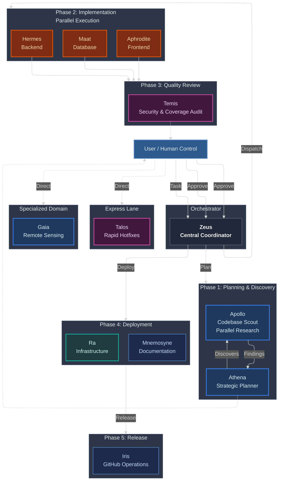
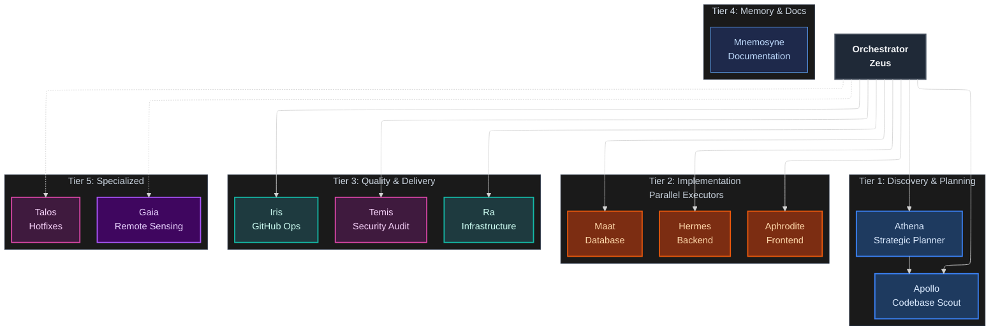
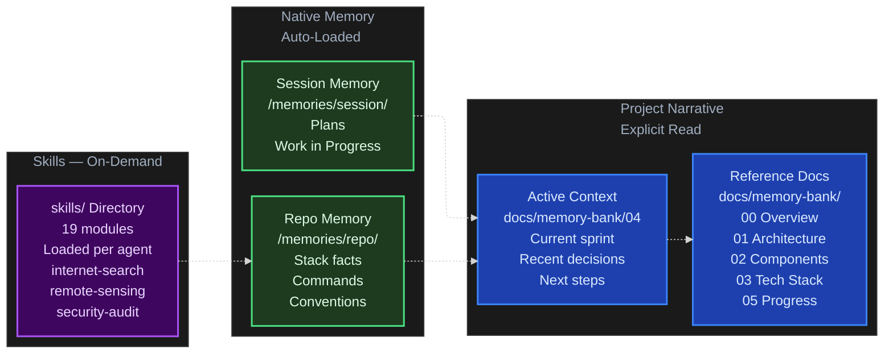

# mythic-agents

**A multi-agent orchestration framework for GitHub Copilot that coordinates specialized AI agents to implement production-ready features with enforced TDD, continuous code review, and persistent project memory.**

---

## Table of Contents

- [Overview](#overview)
- [How It Works](#how-it-works)
- [The Agents](#the-agents)
- [Workflow](#workflow)
- [Artifact System](#artifact-system)
- [Memory System](#memory-system)
- [Quick Start](#quick-start)
- [Repository Structure](#repository-structure)
- [Advanced Usage](#advanced-usage)
  - [Model assignment](#model-assignment)
  - [Automated Quality Gates via Hooks](#automated-quality-gates-via-hooks)
  - [Dynamic Versioning Flow](#dynamic-versioning-flow-conventional-commits)
  - [Built-in web research](#built-in-web-research-internet-search-skill)
  - [Extended internet access](#extended-internet-access-optional-mcp)
- [Security & Privacy](#security--privacy)
- [Contributing](#contributing)
- [FAQ](#faq)

---

## Overview

Traditional single-agent coding produces mediocre results because one agent attempts to plan, implement, test, review, and document simultaneously. The result is context fragmentation, skipped tests, and generic code.

mythic-agents solves this with **specialization**: each agent is an expert at exactly one thing and is invoked only when that expertise is needed.

| Metric | Single Agent | mythic-agents |
|---|---|---|
| Implementation time | 8–10 hours | 6–8 hours |
| Average test coverage | 65–75% | 92% |
| Code review cadence | End of feature | After every phase |
| Bugs reaching production | 3–5 per feature | 0 (TDD enforced) |
| Documentation | Manual | Auto-generated |

---

## How It Works

The system operates in defined phases controlled by **you**. Agents work in parallel within each phase, and every transition is gated by your explicit approval.

> 📖 **Official VSCode Documentation:** See [Agents overview](https://code.visualstudio.com/docs/copilot/agents/overview) for built-in agents, [Custom agents](https://code.visualstudio.com/docs/copilot/customization/custom-agents) for agent structure, and [Subagents](https://code.visualstudio.com/docs/copilot/agents/subagents) for delegation patterns.



### Three Core Principles

**1. Specialization**

Each agent has a focused, narrow context. Hermes knows FastAPI async patterns and nothing about React. Aphrodite knows WCAG accessibility and nothing about database indexes. This produces better code than a generalist at every layer.

**2. Test-Driven Development — enforced**

No phase proceeds without minimum 80% test coverage. The RED → GREEN → REFACTOR cycle is not optional:

```
RED      Write a failing test. The requirement is now defined in code.
GREEN    Write the minimum implementation to make it pass.
REFACTOR Improve the code without breaking the test.
```

**3. You stay in control — via artifacts**

Every phase produces a structured **artifact** (a file in `docs/memory-bank/.tmp/`) before anything proceeds. You read the artifact, approve or request changes, then the next phase begins. There are three explicit pause points where the system stops and waits for your approval. AI does the work; you make every architectural and commit decision.

---

## The Agents

Each agent is a [custom VS Code agent](https://code.visualstudio.com/docs/copilot/customization/custom-agents) optimized for a specific role. Agents inherit the following properties from their `.agent.md` file:

- **Model**: CPU allocation (e.g., Haiku for light tasks, Opus for deep reasoning)
- **Tools**: Capability restrictions (e.g., Temis = read-only; Hermes = read/write/execute)
- **Handoffs**: Sequential workflow transitions to other agents
- **Scope**: Context boundaries (e.g., Apollo = isolated research context; Hermes = backend-only)

### Agent Directory

| Agent | Specialty | Key capabilities | Context | When to call |
|---|---|---|---|---|
| **Zeus** | Central orchestrator | Multi-agent coordination, parallel phase dispatch, approval gates, mid-session model switching | Orchestrates 2+ agents (Athena, Apollo, {Hermes, Aphrodite, Maat}, Ra, Temis, Iris) | Any feature spanning 2+ layers |
| **Athena** | Strategic planner | Research-first architecture design, phased TDD roadmaps, `internet-search` skill, delegates to Apollo | Reads codebase via Apollo; generates architectural plans; handoff to Zeus | Before complex features |
| **Apollo** | Codebase & web scout | 3–10 parallel read-only searches, `web/fetch` for external docs/GitHub — never edits | Isolated context; parallel search; no state changes | Locating code, debugging, pre-implementation discovery |
| **Hermes** | Backend specialist | FastAPI async/await, Pydantic v2, TDD (RED→GREEN→REFACTOR), OWASP-safe APIs, `security-audit` skill | Full Python/FastAPI editing; can test via CI/CD tools; limited to backend scope | New endpoints, services, business logic, auth |
| **Aphrodite** | Frontend specialist | React 19, TypeScript strict, WCAG AA, browser screenshot + accessibility audit, `frontend-analyzer` skill | Full React/TypeScript editing; browser tools for visual verification; integration tests | Components, pages, hooks, responsive, accessibility |
| **Maat** | Database specialist | SQLAlchemy 2.0, Alembic, N+1 detection, EXPLAIN ANALYZE, zero-downtime migrations, `database-optimization` skill | Edit migrations & models; cannot run migrations directly (user must `python manage.py migrate`) | Schema changes, slow queries, indexes, migrations |
| **Temis** | Quality & security gate | OWASP Top 10, coverage ≥80% hard block, lightweight checks (trailing spaces, hard tabs, wild imports), `code-review-checklist` skill | Read-only; reviews only changed files; calls PreToolUse/PostToolUse hook logs | After every implementation phase |
| **Iris** | GitHub operations | Branch creation (Conventional Commits), PR lifecycle, issue management, semantic versioning releases | Full GitHub API access; cannot force-push or bypass branch protection | After `git commit` — push, PR, releases |
| **Ra** | Infrastructure | Multi-stage Docker builds, docker-compose, GitHub Actions, health checks, non-root containers, `docker-best-practices` | YAML/shell editing; container orchestration; deployment verification | Docker, CI/CD, environment setup |
| **Talos** | Hotfix express lane | Direct file edits, no TDD ceremony, regression check against existing tests — bypasses orchestration | Fast execution; skips approval gates; limited to small fixes | CSS bugs, typos, simple logic issues |
| **Mnemosyne** | Memory & documentation | `docs/memory-bank/` init, ADR authoring, sprint close, `.tmp/` wipe, `/memories/repo/` atomic facts | Writes to persistent memory; no code editing | Explicit: sprint close, architectural decisions |
| **Gaia** | Remote sensing expert | Full RS pipeline: spectral indices, change detection, time series, ML/DL, inter-product agreement metrics, scientific literature, `remote-sensing-analysis` + `internet-search` | Specialized domain knowledge; web+academic search; no code editing | RS analysis, LULC products, algorithm selection |

Each agent is defined in its own [`.agent.md` file](https://code.visualstudio.com/docs/copilot/customization/custom-agents#_custom-agent-file-structure) with a specific model assignment, tool set, and behavioral rules. See [AGENTS.md](AGENTS.md) for the full reference.

**Agent Context Overview:**
Each agent operates within a specific **context** — a combination of:
- **Specialization**: Narrow expertise (e.g., Hermes = FastAPI only, not React or databases)
- **Tools**: Restricted tool access (e.g., Apollo = read-only; Hermes = edit/execute)
- **Model**: Task-appropriate AI model (e.g., Haiku for fast hotfixes, Opus for complex reasoning)
- **Scope**: Defined boundaries (e.g., Temis reviews only changed files, not entire repo)

### Agent Hierarchy by Specialization



The hierarchy is not a limitation but a **capability**. Each tier has a narrow focus, and the Orchestrator (Zeus) delegates to the appropriate tier and specialist for each phase of the feature lifecycle.

---

## 🏗️ Nested Subagents (v2.8.2+)

**Context isolation without overhead**: Instead of a single large context window for discovery, implementation agents can now spawn isolated Apollo subagents for focused research — returning only synthesized findings.

### How nested subagents work

```
Hermes implementing POST /products endpoint

Detects: "I need to find existing POST endpoint patterns"
    ↓ 
CALLS Apollo as nested subagent (brand new isolated context)
    ↓
Apollo searches: "Find all POST endpoints with validation and error handling"
    ↓
Apollo returns: Structured summary with file references
    ↓
Hermes incorporates patterns into implementation
    ↓
Result: 60-70% fewer tokens, clean context for both agents
```

### Which agents support nested Apollo delegation?

| Agent | When it calls Apollo | Impact |
|-------|----------------------|--------|
| **Athena** | Complex architecture (>5 modules) | Delegates research to isolated context; returns findings for planning |
| **Hermes** | Discovering backend patterns | Finds similar endpoints before implementing new one |
| **Aphrodite** | Locating design system components | Discovers existing buttons, modals, headers to reuse |
| **Maat** | Database optimization patterns | Finds indexes, query patterns to apply to new schema |
| **Ra** | Infrastructure pattern discovery | Locates Docker/compose configurations to reference |

### Configuration

Nested subagents are **enabled by default** in v2.8.2+. If you're on an older version:

```json
// .vscode/settings.json
{
  "chat.subagents.allowInvocationsFromSubagents": true
}
```

### Benefits

- ✅ **Context isolation** — Each nested agent works in a clean window
- ✅ **Parallelism** — Multiple agents spawn Apollo research simultaneously
- ✅ **Efficiency** — Focused research with synthesized output (vs raw code dumps)
- ✅ **Recursion safety** — Max nesting depth 5 prevents loops
- ✅ **Transparency** — Full visibility of delegation chain in chat

---

## Workflow

### Full orchestration (recommended for complex features)

```
@zeus: Implement email verification with rate limiting and 24-hour token expiry
```

Zeus plans with Athena, discovers context with Apollo, then coordinates Maat → Hermes → Aphrodite in parallel, with Temis reviewing after each phase.

**Orchestration Pattern:** This uses [subagent delegation](https://code.visualstudio.com/docs/copilot/agents/subagents#_orchestration-patterns) — Zeus (coordinator) spawns specialized workers (Athena, Apollo, Hermes, Aphrodite, Maat) with isolated context and tool permissions.

### Direct invocation (for focused tasks)

```
# Backend only
@hermes: Create POST /products endpoint with cursor-based pagination

# Frontend only
@aphrodite: Refactor ProductCard for accessibility — target WCAG AA

# Database only
@maat: Optimize orders table — detect and fix N+1 queries

# Review only
@temis: Review this PR for security vulnerabilities

# GitHub workflow
@iris: Create branch feat/product-search and open a draft PR
@iris: Create release v2.5.0 with changelog from last tag

# Discovery only
@apollo: Find all usages of the deprecated getUserById method

# Memory update
@mnemosyne: Close sprint — documented JWT auth implementation
```

### Real-world example: email verification feature

**Request:**
```
@athena: Plan email verification flow — registration sends email, link expires 24h, frontend shows form, rate limit 5/min
```

**Phase 1 — Planning** (Athena):
- Produces **`PLAN-email-verification.md`** in `docs/memory-bank/.tmp/`
- ⏸️ You read the plan, approve or request changes

**Phase 2 — Implementation (parallel)** (Hermes + Aphrodite + Maat simultaneously):
- Hermes: `IMPL-phase2-hermes.md` — APIs, services, 12 tests
- Aphrodite: `IMPL-phase2-aphrodite.md` — `VerificationForm` component, 8 tests
- Maat: `IMPL-phase2-maat.md` — migration, indexes, rollback verified

**Phase 3 — Quality gate** (Temis):
- Produces **`REVIEW-email-verification.md`** — verdict + "Human Review Focus" items
- ⏸️ You read the review, validate the items only you can judge

**Sprint close** (Mnemosyne):
- `docs/memory-bank/.tmp/` wiped (all ephemeral artifacts deleted)
- `04-active-context.md` updated with sprint summary
- ⏸️ You execute `git commit`

---


### 🔄 Native VS Code Handoff Integration

**mythic-agents** is built to take full advantage of the [VS Code Copilot native Agent Handoff feature](https://code.visualstudio.com/docs/copilot/agents/overview#_hand-off-a-session-to-another-agent) out of the box!

> 📖 **Official VSCode Documentation:** See [Handoffs](https://code.visualstudio.com/docs/copilot/customization/custom-agents#_handoffs) for configuring agent transitions with pre-filled prompts.

Instead of mixing all contexts into a single messy chat window, you can seamlessly **hand off** your current context and history to a specialized agent using the UI or the `/delegate` command.

1. **Context Isolation**: When Zeus delegates to Athena (or you click the suggested handoff button), VS Code opens a **brand new chat session** specifically for Athena.
2. **Context Injection**: The *entire chat history* from your conversation with Zeus is automatically carried over to Athena so she doesn't lose track of the plan.
3. **Pristine History**: The original Zeus orchestrator session is archived smoothly, keeping your active chat extremely focused and token-efficient.

All agents have their `handoffs:` pre-configured in their YAML definitions to prompt UI buttons within Copilot chat automatically!

---

## Artifact System

Every phase produces a **structured artifact** — a temporary file written to `docs/memory-bank/.tmp/` that summarizes what was done and what you need to review before the next phase begins.
> 📖 **Official VSCode Documentation:** See [Prompt files](https://code.visualstudio.com/docs/copilot/customization/prompt-files) for how to structure and reuse prompts across agents. Artifacts follow the same customization principles as prompts.
| Artifact | Produced by | Consumed by | What it contains |
|---|---|---|---|
| `PLAN-<feature>.md` | Athena | You, Zeus | Phases, risks, open questions for your judgment |
| `IMPL-<phase>-<agent>.md` | Hermes / Aphrodite / Maat | Temis | What was built, test results, notes for reviewer |
| `REVIEW-<feature>.md` | Temis | You | Verdict, issues found, **Human Review Focus** |
| `DISC-<topic>.md` | Apollo (subagent) | Athena, Zeus | Discovery findings from isolated research |
| `ADR-<topic>.md` | Any agent | All | Architectural decisions — **permanent, committed** |

### Key properties

- **`docs/memory-bank/.tmp/`** is gitignored — artifacts never enter the git history
- On `@mnemosyne Close sprint`, the entire `.tmp/` folder is wiped automatically
- **ADR artifacts** (architectural decisions) go to `docs/memory-bank/_notes/` and are never deleted
- You can inspect the tmp folder at any time — it's a plain directory of markdown files

### Cleanup commands

```
@mnemosyne Close sprint: [summary]    ← wipes .tmp/ + closes sprint
@mnemosyne Clean tmp                  ← wipes .tmp/ without closing sprint
@mnemosyne List artifacts             ← shows what's in .tmp/
```

### Human Review Focus

Every `REVIEW-` artifact includes a **Human Review Focus** section — 1–2 specific items that require your judgment and cannot be fully validated by AI (e.g., business logic correctness, UX decisions, security edge cases specific to your domain).

---

## Memory System

mythic-agents uses two complementary memory layers:



**`04-active-context.md`** is the priority file. Agents read it first when starting any task. It contains the current sprint focus, the most recent architectural decision, active blockers, and next steps.

**Level 1** is loaded automatically — no agent action required. **Level 2** is read explicitly when starting a new feature or joining an ongoing sprint.

### Copilot Instructions bridge

`.github/copilot-instructions.md` is auto-read by Copilot on every VSCode session. It points Copilot to `04-active-context.md` and `00-overview.md` and defines global coding standards for your product.

> 📖 **Official VSCode Documentation:** See [Customization overview](https://code.visualstudio.com/docs/copilot/customization/overview) for the full instruction loading hierarchy and best practices.

When adopting mythic-agents in a product repo, customize this file with your stack and standards.

---

## Quick Start

### Prerequisites

- VSCode 1.87+ with GitHub Copilot Chat 0.20+
- GitHub Copilot subscription (Pro, Pro+, Business, or Enterprise)
- Git basics (`clone`, `commit`, `push`)

### Supported stacks

Backend: Python/FastAPI, Python/Django, Node.js/Express  
Frontend: React/TypeScript, Next.js  
Database: PostgreSQL, MySQL  
Infra: Docker, Traefik, GitHub Actions

### Installation

#### Option A — VS Code Agent Plugin (recommended, no file copy needed)

> **🆕 Requires:** VS Code 1.110+ with `chat.plugins.enabled: true`  
> 📖 **VS Code Plugin Setup:** See [Chat plugins overview](https://code.visualstudio.com/docs/copilot/chat/chat-overview#_chat-plugins) for configuration details.

**1. Add to your VS Code `settings.json`:**

```json
{
  "chat.plugins.enabled": true,
  "chat.plugins.marketplaces": ["ils15/mythic-agents"]
}
```

**2. Install from Extensions view:**  
Open Extensions (`Ctrl+Shift+X`) → search `@agentPlugins` → find **mythic-agents** → **Install**

All 12 agents and 19 skills appear immediately in your Copilot session — no file copying, no repo changes.

**Or install via local path** (if you've already cloned the repo):

```json
{
  "chat.plugins.enabled": true,
  "chat.plugins.paths": {
    "/path/to/mythic-agents": true
  }
}
```

---

#### Option B — Manual copy into your project

```bash
# 1. Clone into your project (or copy the framework folders)
git clone https://github.com/ils15/mythic-agents
cp -r mythic-agents/agents mythic-agents/instructions \
      mythic-agents/prompts mythic-agents/skills \
      mythic-agents/.github mythic-agents/docs \
      /path/to/your-product/

# 2. Customize the Copilot instructions for your product
# Edit .github/copilot-instructions.md — set your stack, standards, and coding patterns

# 3. Initialize your memory bank
# Fill docs/memory-bank/00-overview.md through 03-tech-context.md (do this once)
# Keep docs/memory-bank/04-active-context.md updated at every sprint
```

### Your first feature

```
# 1. Plan
@athena: Plan JWT authentication with refresh tokens
```

Athena produces `docs/memory-bank/.tmp/PLAN-jwt-auth.md`.

```
# 2. Read the plan artifact, then approve
# Open docs/memory-bank/.tmp/PLAN-jwt-auth.md
# Reply: "Approved, proceed"

# 3. Implement
@zeus: Implement JWT auth using the approved plan
```

Zeus coordinates parallel execution (Maat + Hermes + Aphrodite). Each worker produces an `IMPL-` artifact. Temis reviews and produces `REVIEW-jwt-auth.md`.

```
# 4. Read the review artifact, validate Human Review Focus items, then commit
# Open docs/memory-bank/.tmp/REVIEW-jwt-auth.md
git add -A && git commit -m "feat: JWT authentication"

# 5. Close sprint
@mnemosyne Close sprint: JWT authentication complete with refresh tokens
```

Total time for a production-ready feature: **6–8 hours**.

---

## Repository Structure

```
copilot-agents/
├── README.md               — this file
├── AGENTS.md               — full agent reference guide
├── CONTRIBUTING.md         — how to extend the framework
├── LICENSE
│
├── .github/
│   └── copilot-instructions.md   — global rules (auto-read every Copilot session)
│
├── agents/                 — [custom agent definitions](https://code.visualstudio.com/docs/copilot/customization/custom-agents#_custom-agent-file-locations) (.agent.md)
│                            See [Custom agent file structure](https://code.visualstudio.com/docs/copilot/customization/custom-agents#_custom-agent-file-structure)
│   ├── zeus.agent.md       orchestrator
│   ├── athena.agent.md     planner
│   ├── apollo.agent.md     discovery
│   ├── hermes.agent.md     backend
│   ├── aphrodite.agent.md  frontend
│   ├── maat.agent.md       database
│   ├── temis.agent.md      reviewer
│   ├── iris.agent.md       github operations
│   ├── ra.agent.md         infrastructure
│   ├── talos.agent.md      hotfix
│   ├── mnemosyne.agent.md  memory
│   └── gaia.agent.md       remote sensing domain specialist
│
├── instructions/           — [VS Code instruction files](https://code.visualstudio.com/docs/copilot/customization/custom-instructions) (per-domain coding standards)
│   ├── artifact-protocol.instructions.md    ← artifact system rules
│   ├── backend-standards.instructions.md
│   ├── frontend-standards.instructions.md
│   ├── database-standards.instructions.md
│   ├── code-review-standards.instructions.md
│   ├── documentation-standards.instructions.md
│   ├── infra-standards.instructions.md
│   └── memory-bank-standards.instructions.md
│
├── prompts/                — [prompt files](https://code.visualstudio.com/docs/copilot/customization/prompt-files) (agent invocation guides)
│   ├── plan-architecture.prompt.md
│   ├── implement-feature.prompt.md
│   ├── debug-issue.prompt.md
│   ├── review-code.prompt.md
│   ├── optimize-database.prompt.md
│   └── orchestrate-with-zeus.prompt.md
│
├── skills/                 — [agent skills](https://code.visualstudio.com/docs/copilot/customization/agent-skills) — reference documentation (19 directories)
│   ├── agent-coordination/         start here — agent selection guide
│   ├── orchestration-workflow/     step-by-step real-world walkthrough
│   ├── tdd-with-agents/            TDD standards and examples
│   ├── artifact-management/        memory bank structure
│   └── ...                         15 additional specialized skills
│
└── docs/
    └── memory-bank/        — project memory templates (fill per product)
        ├── 00-overview.md          what is this project?
        ├── 01-architecture.md      system design, patterns
        ├── 02-components.md        component breakdown
        ├── 03-tech-context.md      stack, setup, commands
        ├── 04-active-context.md    current sprint focus  ← agents read this first
        ├── 05-progress-log.md      completed milestones (append-only)
        ├── .tmp/                   ← GITIGNORED — ephemeral artifacts (wiped on sprint close)
        │   └── PLAN-*.md, IMPL-*.md, REVIEW-*.md, DISC-*.md
        └── _notes/
            └── ADR-*.md            architectural decision records (permanent, committed)
```

---

## Advanced Usage

### Model assignment

Each agent declares its own model in the [`.agent.md` frontmatter](https://code.visualstudio.com/docs/copilot/customization/custom-agents#_header-optional). The assignments follow the principle of matching model capability to the cognitive cost of the task.

> 📖 **Official VSCode Documentation:** See [Model selection in chat](https://code.visualstudio.com/docs/copilot/chat/model-selection) for how VS Code routes queries to available models.

| Agent | Primary model | Fallback | Rationale |
|---|---|---|---|
| **Zeus** | GPT-5.4 | GPT-5.3-Codex | Complex orchestration, multi-agent coordination, deep reasoning |
| **Athena** | GPT-5.4 | Claude Opus 4.6 | Architecture planning, TDD decomposition, risk analysis |
| **Hermes** | GPT-5.4 | GPT-5.3-Codex | Backend implementation, security-conscious API design |
| **Maat** | GPT-5.4 | GPT-5.3-Codex | Migration reasoning, complex SQL, schema trade-offs |
| **Temis** | GPT-5.4 | GPT-5.3-Codex | Code review, security audits, OWASP validation |
| **Aphrodite** | Gemini 3.1 Pro | GPT-5.4 | UI/UX layout and visual generation, fast frontend iteration |
| **Iris** | GPT-5.4 | GPT-5.3-Codex | GitHub workflow tasks, semantic versioning, release synthesis |
| **Ra** | GPT-5.4 | GPT-5.3-Codex | Docker, compose, CI/CD orchestration |
| **Talos** | Claude Haiku 4.5 | GPT-5.4 | Rapid hotfixes, simple bug fixes, low-latency repairs |
| **Gaia** | GPT-5.4 | GPT-5.3-Codex | Scientific methodology synthesis, literature research, complex RS analysis |
| **Apollo** | Claude Haiku 4.5 | Gemini 3 Flash | Parallel codebase search at minimal token cost |
| **Mnemosyne** | Claude Haiku 4.5 | GPT-5.4 mini | Documentation formatting, text-only tasks, low complexity |

You do not need to configure this — it is defined per agent in the frontmatter.

### Automated Quality Gates via Hooks

**🆕 Introduced:** Version 2.7.0+ (March 2026)  
**Official docs:** [Agent hooks in VS Code](https://code.visualstudio.com/docs/copilot/customization/hooks)

**mythic-agents** includes a comprehensive hook system that automatically validates code quality, security, and formatting at every phase of execution. Hooks are workspace-level middleware that execute around agent tool calls — no explicit agent invocation needed.

> 📖 **Official VSCode Documentation:** See [Agent hooks in VS Code](https://code.visualstudio.com/docs/copilot/customization/hooks) for the full hook specification, lifecycle events, input/output formats, and security considerations.

#### Hook System Lifecycle

```mermaid
---
config:
  look: classic
  theme: dark
  layout: elk
---
flowchart LR
    classDef h1 fill:#7c2d12,stroke:#ea580c,stroke-width:2px,color:#fed7aa
    classDef h2 fill:#1e3a3f,stroke:#14b8a6,stroke-width:2px,color:#ccfbf1
    classDef h3 fill:#3f065f,stroke:#a855f7,stroke-width:2px,color:#e9d5ff
    classDef event fill:#1e3a5f,stroke:#3b82f6,stroke-width:2px,color:#dbeafe
    classDef check fill:#1e3a1f,stroke:#4ade80,stroke-width:2px,color:#dcfce7

    subgraph P1["Phase 1: Security & Format<br/>v2.8.0+"]
        Pre1["PreToolUse<br/>validate-tool-safety.sh"]:::h1
        Post1["PostToolUse<br/>format-multi-language.sh"]:::h1
        Log1["SessionStart<br/>log-session-start.sh"]:::h1
    end

    subgraph P2["Phase 2: Delegation Tracking<br/>v2.8.0+"]
        Pre2["SubagentStart<br/>on-subagent-delegation-start.sh"]:::h2
        Post2["SubagentStop<br/>on-subagent-delegation-stop.sh"]:::h2
    end

    subgraph P3["Phase 3: Type & Import Audit<br/>v2.8.0+"]
        Post3a["PostToolUse<br/>run-type-check.sh"]:::h3
        Post3b["PostToolUse<br/>audit-imports.sh"]:::h3
        Pre3["PreToolUse<br/>scan-secrets.sh"]:::h3
    end

    Agent["Agent<br/>Executes Tool"]:::event
    Block{{"Block<br/>or<br/>Proceed"}}:::check
    Result["Tool Result<br/>Formatted & Validated"]:::check

    Agent --> Pre1
    Pre1 --> Post1
    Post1 --> Log1
    Log1 --> Pre2
    Pre2 --> Post2
    Post2 --> Post3a
    Post3a --> Post3b
    Post3b --> Pre3
    Pre3 --> Block
    Block -->|Safe| Result
    Block -->|Blocked| Agent

    style P1 fill:#1a1a1a,stroke:#2d3748,stroke-width:1px,color:#cbd5e0
    style P2 fill:#1a1a1a,stroke:#2d3748,stroke-width:1px,color:#cbd5e0
    style P3 fill:#1a1a1a,stroke:#2d3748,stroke-width:1px,color:#cbd5e0
```



#### How Hooks Work

Hooks are configured in `.github/hooks/` as JSON files and execute automatically when agents are active:

**Three key properties:**
1. **Automatic execution** — Hooks fire based on [lifecycle events](https://code.visualstudio.com/docs/copilot/customization/hooks#_hook-lifecycle-events); agents don't invoke them explicitly
2. **Agent inheritance** — When an agent is active, it inherits applicable hooks for its domain
3. **Async, non-blocking** — Hooks execute in <100ms; they augment tool calls without slowing down execution

#### Hook Lifecycle (Phases 1-3)

| Phase | Hooks added | [Lifecycle event](https://code.visualstudio.com/docs/copilot/customization/hooks#_hook-lifecycle-events) | Purpose |
|---|---|---|---|
| **Phase 1** (Security, Formatting, Logging) | `security.json`, `format.json`, `logging.json` | [`PreToolUse`](https://code.visualstudio.com/docs/copilot/customization/hooks#_pretooluse), [`PostToolUse`](https://code.visualstudio.com/docs/copilot/customization/hooks#_posttooluse), [`SessionStart`](https://code.visualstudio.com/docs/copilot/customization/hooks#_sessionstart) | Block destructive operations; auto-format Python/JS/TS/YAML/JSON; log session metadata |
| **Phase 2** (Delegation tracking) | `delegation-start.json`, `delegation-stop.json` | [`SubagentStart`](https://code.visualstudio.com/docs/copilot/customization/hooks#_subagentstart), [`SubagentStop`](https://code.visualstudio.com/docs/copilot/customization/hooks#_subagentstart) | Track when agents hand off to subagents; complete audit trail of delegation chain |
| **Phase 3** (Type checking, import analysis, secret scanning) | `type-check.json`, `import-audit.json`, `secret-scan.json` | [`PostToolUse`](https://code.visualstudio.com/docs/copilot/customization/hooks#_posttooluse), [`PreToolUse`](https://code.visualstudio.com/docs/copilot/customization/hooks#_pretooluse) | Validate Python/TypeScript types; prevent wildcard imports; block hardcoded secrets |

#### Hook-Agent Integration

Each agent inherits applicable hooks based on its role. Temis (the QA reviewer) is the primary consumer of validation hooks:

| Agent | Inherited hooks | Auto-validation |
|---|---|---|
| **Hermes** (Backend) | `format`, `type-check`, `import-audit`, `secret-scan` | Python code: Black+isort, type errors, wildcard imports, API keys in code |
| **Aphrodite** (Frontend) | `format`, `type-check`, `secret-scan` | JS/TS code: Biome/Prettier, TypeScript strict mode, secret leaks |
| **Maat** (Database) | `format`, `secret-scan` | SQL migrations: format validation, password leak prevention |
| **Ra** (Infrastructure) | `format`, `secret-scan` | Configs: YAML validation, env var security |
| **Temis** (Review) | All Phase 1-3 hooks | Reads hook outputs to auto-verify code quality before approval |
| **Iris** (GitHub) | `security` (read-only) | Blocks destructive git operations (rm -rf, force push) |

#### Security Gates & Quality Gates (Automatic)

**Security Gates** — [`PreToolUse` hook](https://code.visualstudio.com/docs/copilot/customization/hooks#_pretooluse) blocks dangerous operations before execution:
- ❌ `rm -rf` — Destructive file removal
- ❌ `DROP TABLE` — Database destruction  
- ⚠️ `TRUNCATE` — Requires user approval
- ❌ Hardcoded secrets (API keys, tokens) — Blocks on detection

**Quality Gates** — [`PostToolUse` hook](https://code.visualstudio.com/docs/copilot/customization/hooks#_posttooluse) enforces code quality standards:
- ❌ Wildcard imports (`from X import *`) — Blocked by `import-audit.json`
- ⚠️ Type errors (Python/TypeScript) — Warned by `type-check.json`
- ⚠️ Formatting issues — Auto-fixed by `format.json` hooks

All safe operations pass through automatically with no user intervention required.

#### Example: Automatic Code Validation During Implementation

**Scenario:** Hermes is implementing a new backend endpoint. Without hooks, formatting and type errors might slip through. With hooks:

1. **PreToolUse** (`security.json`) fires when Hermes attempts to write code
   - Checks for hardcoded secrets (API keys, DB passwords)
   - ✅ Passes — no secrets detected

2. **PostToolUse** (`format.json`) fires after code is written
   - Detects Python file → routes to `format-python.sh`
   - Runs Black + isort automatically
   - Reformatted code is returned to Hermes

3. **PostToolUse** (`type-check.json`) fires
   - Runs Pyright on changed files
   - Returns type errors (if any)
   - Hermes sees the errors and fixes them before moving on

4. **PostToolUse** (`import-audit.json`) fires
   - Detects and blocks wildcard imports (`from module import *`)
   - Returns audit results to Hermes

5. **Phase 3** — Temis review phase
   - Temis reads hook logs from all PostToolUse events
   - Verifies all auto-validations passed
   - Approves or requests fixes

**Result:** Code is formatted, type-safe, secure, and audit-logged — all automatically.

#### Handlers and Scripts

All hooks are implemented via shell scripts in `scripts/hooks/`:

```
scripts/hooks/
├── validate-tool-safety.sh         # Security gate (PreToolUse)
├── format-multi-language.sh        # Main formatter router (PostToolUse)
├── format-python.sh               # Black + isort
├── format-typescript.sh           # Biome or Prettier
├── format-data.sh                 # JSON/YAML validation
├── run-type-check.sh              # Pyright + TypeScript
├── audit-imports.sh               # Wildcard import detection
├── scan-secrets.sh                # Secret pattern scanning (PreToolUse)
├── log-session-start.sh           # Audit trail (SessionStart)
├── on-subagent-delegation-start.sh  # Delegation tracking
└── on-subagent-delegation-stop.sh   # Completion logging
```

Each script is executable (755) and auto-invoked by its corresponding hook configuration file.

#### Quick Reference: Hook Configuration

See the [VS Code hook configuration guide](https://code.visualstudio.com/docs/copilot/customization/hooks#_configure-hooks) for the complete specification, including:

- [Hook file locations](https://code.visualstudio.com/docs/copilot/customization/hooks#_hook-file-locations) (workspace, user, custom agent)
- [Hook configuration format](https://code.visualstudio.com/docs/copilot/customization/hooks#_hook-configuration-format)
- [Hook input and output fields](https://code.visualstudio.com/docs/copilot/customization/hooks#_hook-input-and-output)
- [Security considerations](https://code.visualstudio.com/docs/copilot/customization/hooks#_security-considerations)

**Language-Specific Formatters Available:**
- `scripts/hooks/format-multi-language.sh` — Auto-detect & route to language formatter
- `scripts/hooks/format-python.sh` — Black + isort for Python
- `scripts/hooks/format-typescript.sh` — Biome or Prettier for JS/TS  
- `scripts/hooks/format-data.sh` — JSON/YAML validation and formatting

#### Customizing Hooks in mythic-agents

To add or modify a hook:

1. **Add a JSON config** in `.github/hooks/[name].json`
   ```json
   {
     "hooks": {
       "PreToolUse": [
         {
           "type": "command",
           "command": "./scripts/hooks/[your-script].sh",
           "timeout": 15
         }
       ]
     }
   }
   ```

2. **Create the handler script** in `scripts/hooks/[your-script].sh`
   ```bash
   #!/bin/bash
   # Your validation logic here
   # Return exit code 0 to allow, 2 to block
   echo '{"continue": true}' # or {"continue": false, "stopReason": "..."}'
   ```

3. **Test with an agent** — Run an agent operation that triggers the event; hooks execute automatically.

**For more details:**
- See [Hook configuration format](https://code.visualstudio.com/docs/copilot/customization/hooks#_hook-configuration-format) in the VS Code docs
- See `.github/copilot-instructions.md` for the full mythic-agents hook system configuration
- See `scripts/hooks/` for existing handler implementations

### Dynamic Versioning Flow (Conventional Commits)

To keep versioning objective and automatic, mythic-agents now supports a commit-driven flow:

- `BREAKING CHANGE` or `type(scope)!:` in commit subject → **major** bump
- `feat:` commits → **minor** bump
- any other conventional type (`fix:`, `refactor:`, `docs:`, `chore:`, etc.) → **patch** bump

Commands:

```bash
npm run version:recommend   # shows recommended bump + next version
npm run version:auto        # applies recommended bump to all manifests
npm run version:minor       # force minor bump
```

Files updated automatically by the script:
- `package.json`
- `plugin.json`
- `.github/plugin/plugin.json`

CI automation included:
- `.github/workflows/version-recommendation.yml` — runs on PR and comments recommended bump (`version:recommend`)
- `.github/workflows/tag-version-sync.yml` — runs on tag push (`v*`) and validates all 3 manifests are synchronized and match the tag
- `.github/workflows/release-drafter.yml` + `.github/release-drafter.yml` — optional assisted release draft/changelog generation
- `.github/workflows/pr-conventional-labels.yml` — applies PR labels automatically from Conventional Commit title (used by Release Drafter/version resolver)

### Built-in web research (`internet-search` skill)

Agents with `web/fetch` access — Athena, Apollo, Gaia, Zeus — use the **`internet-search` skill** for structured external research without any additional setup:

- **Academic APIs**: Semantic Scholar, CrossRef, arXiv, EarthArXiv, MDPI — structured JSON, no scraping required
- **Code research**: GitHub Search API, PyPI JSON API, npm registry
- **Pattern**: parallel queries → parse structured JSON → synthesise → cite sources in output

See [skills/internet-search/SKILL.md](skills/internet-search/SKILL.md) for URL patterns, query construction, and result synthesis templates.

### Extended internet access (optional MCP)

For broader web search beyond structured APIs, you can optionally add an MCP search server:

```json
// .vscode/settings.json or MCP config
"mcpServers": {
  "brave-search": {
    "command": "npx",
    "args": ["-y", "@modelcontextprotocol/server-brave-search"],
    "env": { "BRAVE_SEARCH_API_KEY": "your-key-here" }
  }
}
```

MCP is optional. All structured API research (academic papers, GitHub, PyPI) works natively via the `internet-search` skill without MCP.

---

## Security & Privacy

**This system does not:**
- Send your code to external APIs — all processing stays within VSCode and GitHub Copilot
- Store your code or track usage
- Use your code to train models (GitHub Copilot ToS)
- Commit anything automatically — you control every git operation

**Temis enforces on every phase:**
- Quick quality checks (changed files only): trailing whitespace, hard tabs in Python, wild imports
- OWASP Top 10 compliance
- SQL injection, XSS, CSRF prevention
- Dependency vulnerability scanning
- Hardcoded secret detection
- Minimum 80% test coverage (hard block below this threshold)

---

## Contributing

See [CONTRIBUTING.md](CONTRIBUTING.md) for the full guide. The short version:

**Adding an instruction file:**
```
instructions/[domain]-standards.instructions.md
```
Include 5–10 core principles, example patterns, anti-patterns, and verification methods.

**Adding a skill:**
```
skills/[skill-name]/SKILL.md
```
Include a 2–3 sentence overview, usage conditions, step-by-step examples, and links to related skills.

**Adding an agent:**  
Follow the `.agent.md` frontmatter format defined in any existing agent. Assign a specific model, tool set, and behavioral constraints.

---

## FAQ

**How much does this cost?**  
You need an existing GitHub Copilot subscription (Pro $20/month or an Organization seat). No additional cost beyond that.

**Can I use this in editors other than VSCode?**  
Not directly. The `.agent.md` format and Copilot Chat agent mode are VSCode-specific. The concepts are portable, but the agent invocation syntax is not.

**Can I override Temis's code review?**  
You can proceed past Pause Point 2 even if Temis flags issues. The exception is test coverage — if coverage is below 80%, the block is automatic and by design.

**How long does a typical feature take?**  
Simple endpoints: 2–4 hours. Full features (backend + frontend + DB): 6–8 hours. Large systems: 20–30 hours across multiple sessions, all tracked in `docs/memory-bank/`.

**What happens if Copilot drops mid-session?**  
Open phases pause. The memory bank (`docs/memory-bank/`) captures the last committed state. Resume by reading `04-active-context.md` at the start of the next session.

**Can I add my own agents?**  
Yes. Read `AGENTS.md` for the architecture, then create a new `.agent.md` file in `agents/`. The system is designed to be extended.

---

## Documentation

| Resource | Purpose |
|---|---|
| [AGENTS.md](AGENTS.md) | Full agent reference — behavior, tools, constraints |
| [CONTRIBUTING.md](CONTRIBUTING.md) | How to extend the framework |
| [skills/agent-coordination/](skills/agent-coordination/SKILL.md) | Agent selection guide — when to use which agent |
| [skills/orchestration-workflow/](skills/orchestration-workflow/SKILL.md) | Real-world step-by-step walkthrough |
| [skills/tdd-with-agents/](skills/tdd-with-agents/SKILL.md) | TDD standards and coverage rules |
| [instructions/memory-bank-standards.instructions.md](instructions/memory-bank-standards.instructions.md) | Memory architecture — how agents read and write context |

---

## Changelog

### v2.7 — March 9, 2026

#### Versioning and Release Flow
- Bumped repository version to **2.7.0** and synchronized manifests:
    - `package.json`
    - `plugin.json`
    - `.github/plugin/plugin.json`
- Added automated versioning script at `scripts/versioning.mjs` with commit-based bump recommendation and apply modes.
- Added npm scripts for daily release workflow:
    - `version:recommend`
    - `version:auto`
    - `version:patch`
    - `version:minor`
    - `version:major`
- Defined dynamic semantic versioning policy based on Conventional Commits directly in this README.
- Added CI automation for the full flow:
    - PR comment with recommended bump (`version-recommendation.yml`)
    - tag-time manifest sync validation (`tag-version-sync.yml`)
    - optional release draft/changelog assistance (`release-drafter.yml`)

### v2.6 — March 9, 2026

#### Hardening Final (Model + Browser + Consistency)
- Standardized model routing across all core agents to the modern baseline:
    - Zeus, Athena, Hermes, Maat, Temis, Ra, Iris: `GPT-5.4` primary + `Claude Opus 4.6` fallback
    - Aphrodite: `Gemini 3.1 Pro` primary + `GPT-5.4` fallback
    - Talos: `Claude Haiku 4.5` primary + `GPT-5.4` fallback
    - Gaia: `Claude Sonnet 4.6` primary + `GPT-5.4` fallback
    - Apollo and Mnemosyne unchanged by role design (fast discovery/docs focus)
- Added explicit **plan validation lane**: Athena drafts the plan, Temis validates plan quality/risk/test strategy, then Zeus executes only after approval.
- Completed browser modernization from legacy MCP-style references to VS Code native integrated browser tools for web validation workflows.

#### Agent and Tooling Updates
- **`agents/aphrodite.agent.md`** — browser-enabled frontend verification flow expanded with:
    - `openBrowserPage`, `navigatePage`, `readPage`, `clickElement`, `typeInPage`, `hoverElement`, `dragElement`, `handleDialog`, `screenshotPage`, `runPlaywrightCode`
    - clear enablement instructions (`workbench.browser.enableChatTools=true` + Share with Agent)
- **`agents/temis.agent.md`** — integrated browser validation path for critical UI/user-flow review evidence.
- **`agents/apollo.agent.md`** — integrated browser recon support for discovery when live page evidence is relevant.

#### Documentation Synchronization
- **`AGENTS.md`** — model strategy table and browser integration guidance refreshed; plan validation lane documented.
- **`README.md`** — model assignment table updated to current strategy; duplicate/legacy entries cleaned.
- **`CONTRIBUTING.md`** — frontmatter example modernized to current model array + canonical tool naming.

#### Verification and Cleanup
- Perplexity MCP references checked and confirmed absent (`perplexity`, `mcp_perplexity`, `mcp_perplexity-as_perplexity_ask`).
- Instructions and skills reviewed for this modernization pass; no incompatible browser-tool or Perplexity remnants found.

### v2.5 — March 4, 2026

#### New Agent
- **`Iris`** (η ἴρις) — GitHub operations specialist. Closes the last manual gap in the development lifecycle by owning all GitHub write operations: branch creation (Conventional Commits), pull request lifecycle (draft → review → squash merge), issue management, semantic release tagging, and changelog generation. Uses all `mcp_github2_*` tools. Never merges or releases without explicit human confirmation via `vscode/askQuestions`.

#### New GitHub Actions
- **`.github/workflows/validate-agents.yml`** — On every PR, validates YAML frontmatter syntax of all `.agent.md` files. Catches broken frontmatter before it ships (see v2.4 Gaia bug). Uses `yamllint` + a custom consistency checker that verifies every agent listed in `AGENTS.md` has a corresponding file in `agents/`.
- **`.github/workflows/release.yml`** — On `git tag v*.*.*` push, automatically creates a GitHub Release with the body extracted from the matching section in `CHANGELOG.md`. Enables `@iris` to trigger versioned releases by pushing a tag.

#### Documentation
- **`CHANGELOG.md`** — Standalone changelog file added to root (previously changelog was embedded only in `README.md`). Both are now kept in sync.
- **`README.md`** — Added Iris to agents table, repository structure, mermaid orchestration diagram (Phase 5 — GitHub Publish), model assignment table, and direct invocation examples.
- **`AGENTS.md`** — Added Iris section under new Publishing & GitHub Tier, updated Zeus delegates chain, Agent Selection Guide, and Model Strategy.
- **`agents/zeus.agent.md`** — Added `iris` to `agents:` list and `description:` delegates chain.

---

### v2.4 — February 27, 2026

#### New Skills
- **`internet-search`** — Web research skill covering `web/fetch` usage patterns, structured academic APIs (Semantic Scholar, CrossRef, arXiv, EarthArXiv, MDPI), GitHub and PyPI search, query construction best practices, parallel search strategy, and result synthesis templates. Wired into `gaia`, `athena`, and `zeus`.

#### Expanded Skills
- **`remote-sensing-analysis`** — Completely rewritten from LULC-only scope to full remote sensing pipeline. Now covers: raster processing, radiometric & atmospheric correction, spectral indices (NDVI, EVI, SAVI, NDWI, NBR, NDSI, BSI), SAR processing & speckle filtering, change detection methods, time series analysis, ML/DL classification (U-Net, Random Forest, SVM, XGBoost), LULC product ensembles, inter-product agreement metrics (Kappa, OA, F1, Dice, temporal frequency), accuracy assessment (Olofsson 2014 method), LULC reference tables, quality checklist, and remote sensing data API index.

#### Full English Translation
All framework files are now entirely in English. Previously Portuguese content translated:
- `skills/nextjs-seo-optimization/SKILL.md` and `seo-config.ts` — site name, locale, currency, category strings, descriptions
- `skills/playwright-e2e-testing/SKILL.md` — test selector strings, assertion messages
- `skills/remote-sensing-analysis/SKILL.md` — full rewrite in English
- `prompts/optimize-database.prompt.md` — title and all bullet points
- `agents/zeus.agent.md` — isolated Portuguese word (`"Nenhum"` → `"None"`)

#### Bug Fixes
- **`agents/gaia.agent.md`** — Fixed YAML syntax error: `model:` second entry was missing quotes, causing invalid frontmatter
- **`AGENTS.md`** — Zeus `Delegates to:` chain was missing `talos`; updated to reflect the full 9-agent delegation list
- **`prompts/orchestrate-with-zeus.prompt.md`** — Hardcoded agent count `8` → `9` (Zeus frontmatter has 9 agents: athena, apollo, hermes, aphrodite, maat, temis, ra, mnemosyne, talos)
- **`skills/README.md`** — Corrected skill count, added **Domain Specialist** category listing `remote-sensing-analysis` and `internet-search`
- **`README.md`** — Corrected hardcoded `(24 directories)` → `(19 directories)` and `20 additional` → `15 additional` in the repo tree

#### Cleanup
- Removed zombie directory `skills/9-agent-coordination/` — was an orphaned duplicate of `agent-coordination/` with no references

---

### v2.3 — February 2026

- Added **Gaia** remote sensing domain specialist agent (`agents/gaia.agent.md`) with `disable-model-invocation: true` to prevent accidental generic invocation
- Added **Talos** hotfix express-lane agent (`agents/talos.agent.md`) with bypass for TDD ceremony on trivial fixes
- Native VS Code Handoff integration documented — all agents now have `handoffs:` pre-configured in YAML
- Added `vscode/askQuestions` tool to orchestrator and planner agents (Athena, Zeus, Aphrodite, Hermes, Maat) to support interactive approval gates
- Updated browser integration strategy: agents now prefer VS Code Integrated Browser chat tools (`openBrowserPage`, `navigatePage`, `readPage`, `clickElement`, `typeInPage`, `screenshotPage`) instead of external MCP-only browser flows
- `skills/prompt-improver` — added with `EXAMPLES.md` and `USAGE.md`
- `skills/frontend-analyzer` and `skills/web-ui-analysis` — added

---

**Version:** 2.7 &nbsp;|&nbsp; **Updated:** March 9, 2026 &nbsp;|&nbsp; **License:** MIT
