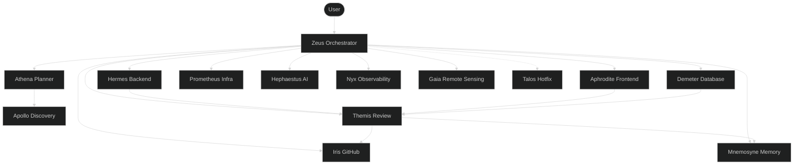

# Pantheon — Multi-Agent Framework

> 14 agents for VS Code Copilot/OpenCode. Conductor-Delegate pattern.

## What
Automates **plan → discover → implement → review → deploy → document** with TDD, 3 human approval gates, >80% coverage.

## Architecture


**Patterns:** Conductor-Delegate | DAG Waves | TDD (RED→GREEN→REFACTOR)

## Agents (by tier)
| premium | Zeus (orchestrate), Athena (plan), Themis (review) |
| default | Hermes (backend), Aphrodite (frontend), Demeter (db), Prometheus (infra), Hephaestus (AI), Gaia (remote sensing) |
| fast | Apollo (discover), Iris (GitHub), Nyx (observability), Mnemosyne (memory), Talos (hotfix) |

## Tech Stack
| Layer | Tech |
|---|---|
| Agent format | Markdown + YAML (`.agent.md`) with `mcpServers` frontmatter for per-agent MCP binding |
| Config | JSON (`opencode.json`) |
| Platform | VS Code Copilot, OpenCode, Cursor, Claude Code |
| CI/CD | GitHub Actions |
| Backend | Python 3.12+, FastAPI |
| Frontend | React 19, TypeScript strict |
| Database | PostgreSQL, SQLAlchemy 2.0, Alembic |

## Repo Structure
```
/agents/  /skills/  /instructions/  /prompts/  /platform/  /memories/repo/
```

## Commands
```bash
opencode sync status                            # Sync config
pytest -v / npx vitest run                      # Tests
ruff check / biome check                        # Lint
```

## Key Decisions
| Decision | Why |
|---|---|
| Conductor-Delegate | Separation of concerns, parallelism |
| DAG Waves | Critical path, not sum of phases |
| TDD mandatory | >80% coverage, no regression |
| 3-tier memory | Facts (zero-cost) / Patterns (lazy) / Conventions (always) |
| Skills lazy-load | 36 skills (cross-platform), only relevant ones loaded |

> **Agents:** Read `01-active-context.md` first. See `_notes/_index.md` for ADRs.
> **Memory rules:** `skills/memory-bank/SKILL.md`

## Provider Timeout Configuration

### chunkTimeout

**What it is:** Maximum wait time (in milliseconds) for the LLM provider to respond. If the provider takes longer than this, the request is considered failed.

**Location:** `opencode.json` → `provider.opencode.options.chunkTimeout`

**Current value:** `120000` (2 minutes)

**Why this value:** Subagents doing complex research (web search + code search + LLM inference in chain) need up to 2 minutes for a complete round trip. The previous value of 30000 (30s) caused frequent timeouts during multi-agent dispatches.

**How to change:** Edit the `chunkTimeout` field in:
- `~/.config/opencode/opencode.json` (global config)
- `./opencode.json` (project config)

| Value | Use Case |
|-------|----------|
| 60000 | Fast providers, simple queries |
| 120000 | Default — balanced for multi-agent dispatch |
| 300000 | Conservative — research-heavy workflows |

**Note:** Changing this value requires restarting OpenCode to take effect.
