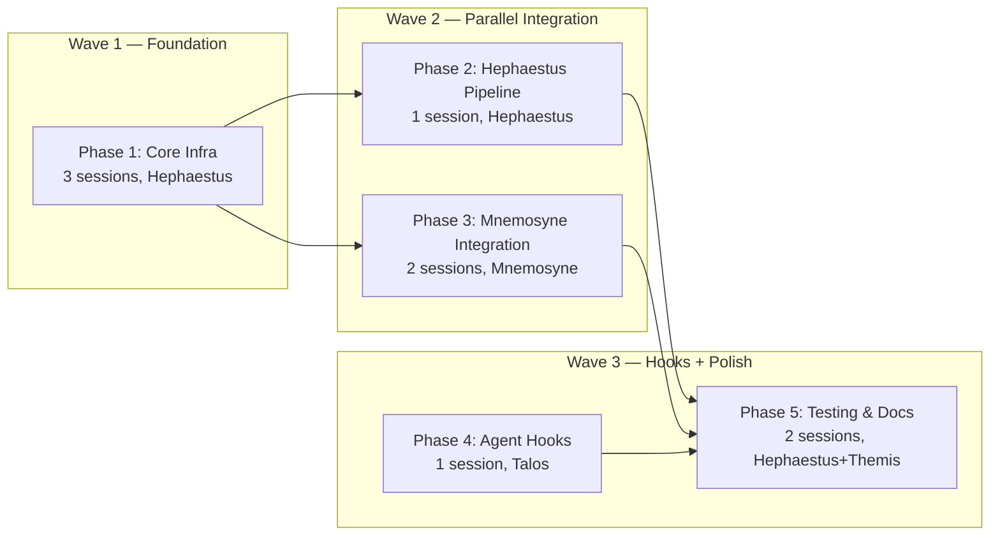

# TASK-016 — Level 3 Vector Memory Implementation

**Date:** 2026-06-26
**Status:** Planning
**Priority:** HIGH
**Dependencies:** NOTE0009 (design), TASK-015 (cleanup, IN_PROGRESS)
**Owner:** @hephaestus (Phase 1), @mnemosyne (Phase 2-3)

---

## Architecture Decision: Hybrid FTS5 + Vector

After evaluating opencode-lcm's pure-FTS5 approach against NOTE0009's sqlite-vec + sentence-transformers design, the recommendation is a **hybrid architecture** with graceful degradation:

### FTS5 vs Vector — Trade-off Analysis

| Criterion | sqlite-vec + sentence-transformers | FTS5 (pure, à la opencode-lcm) |
|-----------|-------------------------------------|-------------------------------|
| Semantic matching | ✅ Understands "token rotation" ≈ "JWT refresh" | ❌ Keyword-only — misses intent |
| ML dependencies | ~200MB sentence-transformers + ~90MB model | Zero — built into SQLite stdlib |
| Cold start latency | ~2-5s (model download/load) | 0ms |
| Per-query latency | ~5ms (embedding) + ~2ms (KNN) | ~1ms (FTS5 MATCH) |
| Storage per entry | ~1.5KB (384 floats) | ~200 bytes (FTS5 token index) |
| Offline capable | ✅ After initial pip install | ✅ Always |
| Recall quality on <100 entries | Similar (ML not worth overhead) | Similar |
| Recall quality on 500+ entries | ✅ Much better (semantic clusters) | ⚠️ Degrades (keyword variance) |
| Python stdlib only | ❌ Needs pip install sqlite-vec + sentence-transformers | ✅ sqlite3 + FTS5 built-in |

### Recommendation: Hybrid with Priority Chain

```
sqlite-vec available? ─yes→ Semantic recall (cosine KNN)
      │ no
      ▼
FTS5 available? ──────yes→ Keyword recall (TF-IDF/BM25)
      │ no
      ▼
Level 1 fallback ──────────→ Flat grep + text search
```

**Both backends coexist in the same `.db` file**, sharing `memory_meta` and `memory_content` tables. Each backend owns its own index table (`vec_memory` for vectors, `memory_fts` for FTS5). The query interface auto-detects which engine is loaded and routes accordingly.

### Why Not Pure FTS5?

Three reasons:

1. **Semantic gap is real** — An agent querying "database migration pattern for adding indexes" won't match FTS5 if the indexed text says "ran alembic upgrade to add composite index on users.email+status". The words "migration" and "indexes" don't overlap enough. Vector search bridges this gap.

2. **Pantheon's volume will grow** — At 2,500+ entries (yearly estimate), keyword-only retrieval loses recall. The discovery found opencode-lcm works well but its scope is session memory (recent conversations). Pantheon's Level 3 is permanent cross-sprint memory.

3. **ML overhead is one-time, manageable** — sentence-transformers is a ~200MB pip install that happens once. In CI/collaborative environments where it's pre-installed, the cost is zero. The FTS5 fallback ensures environments without it still benefit.

### How FTS5 and Vector Coexist

Both backends index the same source content independently, sharing:

| Component | Shared? | Notes |
|-----------|---------|-------|
| `memory_meta` table | ✅ Shared | Metadata: source_type, agent, phase, tags, content_hash |
| `memory_content` table | ✅ Shared | Full text content |
| `vec_memory` virtual table | ❌ sqlite-vec only | 384-dim float vectors, KNN search |
| `memory_fts` virtual table | ❌ FTS5 only | Full-text search with BM25 ranking |
| `index.py` pipeline | ✅ Shared | Writes to both backends; skips if engine unavailable |
| `query.py` interface | ✅ Shared | Unified `recall()` function; auto-detect best backend |

---

## Updated Schema

```sql
-- Shared metadata table
CREATE TABLE memory_meta (
    memory_id INTEGER PRIMARY KEY,
    source_type TEXT NOT NULL,           -- 'adr' | 'subtask_summary' | 'wisdom' | 'impl_artifact' | 'decision'
    source_path TEXT NOT NULL,           -- relative path to original file + optional line number
    agent TEXT,                          -- originating agent (zeus, hermes, etc.)
    phase TEXT,                          -- phase label
    sprint TEXT,                         -- sprint identifier
    priority INTEGER DEFAULT 2,          -- 1=low, 2=medium, 3=high
    tags TEXT,                           -- comma-separated: 'auth,security,jwt'
    created_at TEXT NOT NULL,            -- ISO 8601
    content_hash TEXT UNIQUE NOT NULL,   -- SHA-256 (idempotency key)
    char_count INTEGER NOT NULL
);

-- Full text content (shared by both backends)
CREATE TABLE memory_content (
    memory_id INTEGER PRIMARY KEY,
    content TEXT NOT NULL,
    FOREIGN KEY (memory_id) REFERENCES memory_meta(memory_id)
);

-- Vector index (sqlite-vec extension, 384-dim)
CREATE VIRTUAL TABLE vec_memory USING vec0(
    memory_id INTEGER PRIMARY KEY,
    embedding float[384],
    +source_type TEXT,
    +source_path TEXT,
    +agent TEXT,
    +phase TEXT,
    +sprint TEXT,
    +priority INTEGER,
    +tags TEXT,
    +created_at TEXT,
    +content_hash TEXT
);

-- Full-text search index (FTS5, built-in SQLite)
CREATE VIRTUAL TABLE memory_fts USING fts5(
    memory_id UNINDEXED,
    content,
    source_type UNINDEXED,
    tags UNINDEXED,
    tokenize='porter unicode61'
);

-- Index tables for lookup (only if sqlite-vec not available)
-- memory_fts.content is indexed automatically by FTS5
CREATE INDEX idx_meta_content_hash ON memory_meta(content_hash);
CREATE INDEX idx_meta_source_type ON memory_meta(source_type);
CREATE INDEX idx_meta_agent ON memory_meta(agent);
CREATE INDEX idx_meta_created_at ON memory_meta(created_at);
```

### Key Schema Changes from NOTE0009

| Change | Rationale |
|--------|-----------|
| Added `memory_fts` FTS5 virtual table | Enables keyword fallback without ML deps |
| Added `tokenize='porter unicode61'` | Porter stemming + unicode support for multilingual content |
| No changes to `vec_memory` | NOTE0009's vector schema remains exactly as designed |
| Added secondary indexes on meta | Faster filtering queries for both backends |
| Added `idx_meta_content_hash` | Speeds up idempotency checks during indexing |

---

## Fallback Chain Implementation

```
query.py: recall(query, top_k=5, filters=None)
  │
  ├─ 1. Try sqlite-vec:
  │     model = sentence_transformers.SentenceTransformer('all-MiniLM-L6-v2')
  │     query_vec = model.encode(query)
  │     sql = "SELECT ... FROM vec_memory WHERE embedding MATCH ? AND k = ?"
  │     results = db.execute(sql, [serialize(query_vec), top_k])
  │     if results: return results
  │
  ├─ 2. Fallback to FTS5:
  │     # Tokenize query: split, stem, remove stopwords
  │     query_terms = preprocess_fts5(query)
  │     sql = """
  │       SELECT mm.*, mc.content, bm25(memory_fts, 0, 5.0, 1.0) AS score
  │       FROM memory_fts
  │       JOIN memory_meta mm ON memory_fts.memory_id = mm.memory_id
  │       JOIN memory_content mc ON mm.memory_id = mc.memory_id
  │       WHERE memory_fts MATCH ?
  │       ORDER BY score
  │       LIMIT ?
  │     """
  │     results = db.execute(sql, [query_terms, top_k])
  │     if results: return results
  │
  └─ 3. Final fallback: Level 1 (flat grep)
        # Linear scan through 02-progress-log.md, 01-active-context.md
        grep -i <query> docs/memory-bank/
        return formatted grep results
```

---

## Changes to NOTE0009 Phase 1-5 Plan

### What Stays the Same

| Phase | Scope | Owner | Status |
|-------|-------|-------|--------|
| Phase 1 | Core infrastructure (schema, index, query, rebuild) | @hephaestus | ✅ Still valid — expand for FTS5 |
| Phase 2 | Mnemosyne integration (@mnemosyne Recall, compress_context wiring) | @mnemosyne | ✅ Still valid |
| Phase 3 | Agent pre-action hooks | All agents | ✅ Still valid |
| Phase 4 | Auto-tagging & optimization | @hephaestus | ⏺️ Merge into Phase 1 (auto-tagging is part of indexing) |
| Phase 5 | Node.js binding (optional) | @hephaestus | ✅ Stretch goal, deprioritize |

### What Changes

| Aspect | NOTE0009 | Revised |
|--------|----------|---------|
| Schema | vec0 + meta + content | **+ FTS5 virtual table**, + secondary indexes |
| Index flow | Embedding only | **Dual indexing**: embed + FTS5 tokenize |
| Query flow | Vector KNN only | **Priority chain**: vector → FTS5 → Level 1 grep |
| Dependencies | sentence-transformers + sqlite-vec | **Optional**: both optional (FTS5 fallback always works) |
| Phase 4 | Separate phase for auto-tagging | **Merged into Phase 1**: auto-tag runs during indexing, not after |
| Phase 5 | Node.js binding | **Deprioritized**: not needed for v1 |
| Effort estimate | Not estimated | **Estimated below** |

### Revised Phase Breakdown

---

## Implementation Phases

### Phase 1: Core Infrastructure — Hephaestus
**Effort:** 3 sessions | **Dependencies:** None

- [ ] **1.1** Create `scripts/vector-memory/` directory structure + `requirements.txt`
  - `sqlite-vec>=0.1.9` (optional), `sentence-transformers>=3.0` (optional)
  - `numpy` (shared dependency for vector serialization)
  - No hard dependencies — FTS5 uses stdlib only
  - Test: `pip install -r requirements.txt` passes with and without sentence-transformers

- [ ] **1.2** Implement `scripts/vector-memory/schema.py`
  - `init_database(db_path)` — create .vectordb/pantheon-memory.db
  - `create_tables(conn)` — CREATE TABLE for meta, content, vec0 (try), FTS5
  - `try_load_vec_extension(conn)` — sqlite_vec.load() with graceful failure
  - `schema_version` table for migration tracking
  - Tests: schema creates all tables; graceful failure when sqlite-vec not installed

- [ ] **1.3** Implement `scripts/vector-memory/index.py`
  - `index_entry(text, metadata)` — compute hash → insert to meta → embed + FTS5
  - `index_batch(entries)` — parallel embedding + sequential FTS5
  - `index_file(path, source_type)` — parse file, split sections, index each entry
  - `scan_for_new(conn)` — scan memory bank for unindexed content via content_hash
  - `get_embedding_model()` — singleton with lazy loading + caching
  - Tag auto-extraction: keyword matching + @agent detection (from NOTE0009 §7)
  - Tests: idempotency (re-index same content → skips), FTS5 indexing correctness

- [ ] **1.4** Implement `scripts/vector-memory/query.py`
  - `recall(query, top_k=5, filters=None)` — unified entry point
  - `_recall_vector(query, top_k, filters)` — sqlite-vec KNN with WHERE filters
  - `_recall_fts(query, top_k, filters)` — FTS5 MATCH with bm25 ranking
  - `_recall_grep(query, top_k, filters)` — Level 1 fallback (flat text search)
  - `preprocess_fts5(query)` — stopword removal, basic query term cleanup
  - Result format: list of dicts with score, metadata, content, source_path
  - Tests: all three backends return correct results; filters applied correctly

- [ ] **1.5** Implement `scripts/vector-memory/rebuild.py`
  - Scan all memory bank files (_notes/, 01-active-context.md, 02-progress-log.md)
  - Clear and rebuild meta + content + vec_memory + memory_fts from scratch
  - Progress reporting: "Rebuilding index... 15/127 entries (12%)"
  - Tests: rebuild produces same content_hash → skip behavior as initial index

- [ ] **1.6** Add `docs/memory-bank/.vectordb/` to `.gitignore`
  - Pattern: `docs/memory-bank/.vectordb/`
  - Pattern: `docs/memory-bank/.vectordb/*`
  - Ensure .vectordb/ itself is tracked (mkdir .vectordb/.gitkeep)

### Phase 2: Hephaestus Pipeline — Hephaestus
**Effort:** 1 session | **Dependencies:** Phase 1

- [ ] **2.1** Update `agents/hephaestus.agent.md`
  - Add `vector-memory` to skills list (or reference scripts/vector-memory/)
  - Add pre-indexing hook: "Before closing sprint, run @mnemosyne Recall to validate"
  - Add section: "## Level 3 Vector Memory — Indexing Trigger"

- [ ] **2.2** Wire indexing into `compress_context` handoff
  - In `routing.yml` (or zeus.agent.md trigger docs): after `compress_context` completes, Hephaestus runs `index_batch()` on new entries
  - Return format: "Indexed 12 new entries (vector + FTS5), skipped 45 existing"

- [ ] **2.3** Implement tag auto-extraction in index.py (from NOTE0009 §7)
  - Keyword matching against Pantheon domain list
  - @agent-name detection
  - Merge with manual tags from artifact frontmatter

- [ ] **2.4** Model caching for performance
  - SentenceTransformer singleton: `_MODEL = None` + lazy load `_get_model()`
  - Warm model on first index call; keep alive for session duration
  - Batch embedding: encode(list_of_texts) instead of encode(text) per entry

### Phase 3: Mnemosyne Integration — Mnemosyne + Hephaestus
**Effort:** 2 sessions | **Dependencies:** Phase 1

- [ ] **3.1** Add `@mnemosyne Recall` command handler
  - Parse: `@mnemosyne Recall "query" --top-k 5 --type adr --since 2026-05-01`
  - Call `query.recall()` with parsed parameters
  - Handle errors: "Vector search unavailable, falling back to FTS5..."
  - Tests: mock recall, verify command parsing, error messages

- [ ] **3.2** Wire `compress_context` → auto-index new entries
  - After Mnemosyne compresses phase artifacts (Level 2 completes):
    1. Mnemosyne signals Zeus: "Compression complete, [N] new entries ready for indexing"
    2. Zeus delegates to Hephaestus: `index_batch()` on the compressed entries
    3. Hephaestus returns: "Indexed [N] new entries"
    4. The result feeds into Mnemosyne's summary output
  - This mirrors the sequencing in `instructions/artifact-protocol.instructions.md:251-286`

- [ ] **3.3** Wire `@mnemosyne Close sprint` → final batch index
  - Before wiping `.tmp/`, index all unprocessed entries from the sprint
  - Guarantee: no entry left un-indexed at sprint close

- [ ] **3.4** Result formatting for recall output
  - Use NOTE0009 §5 return format (score table + individual results)
  - Include backend tag: "Searched 157 entries via vector KNN in 12ms"
  - Include "Vector unavailable — used FTS5" when in fallback mode

- [ ] **3.5** Add `opencode.json` vector_memory config block
  ```json
  {
    "vector_memory": {
      "auto_inject_on_read": true,
      "max_injected_entries": 3,
      "min_similarity_score": 0.75,
      "prefer_backend": "auto"
    }
  }
  ```
  - `prefer_backend`: `"auto"` (try vector → FTS5) | `"vector"` | `"fts5"` | `"level1"`
  - Config read by `query.py` on startup

### Phase 4: Agent Pre-Action Hooks — All Agents
**Effort:** 1 session | **Dependencies:** Phase 3

- [ ] **4.1** `agents/zeus.agent.md` — pre-planning recall hook
  - Add to pre-action checklist: "Before planning, @mnemosyne Recall 'related decisions'"

- [ ] **4.2** `agents/hermes.agent.md` — pre-implementation recall hook
  - Add: "Before implementing, @mnemosyne Recall 'related implementations for {feature}'"

- [ ] **4.3** `agents/aphrodite.agent.md` + `agents/demeter.agent.md` — same pattern

- [ ] **4.4** `agents/themis.agent.md` — pre-review recall hook
  - Add: "Before reviewing, @mnemosyne Recall 'past findings on similar code'"

- [ ] **4.5** `agents/athena.agent.md` — plan validation recall hook
  - Add: "During planning, @mnemosyne Recall 'conflicting decisions on {topic}'"

- [ ] **4.6** `agents/hephaestus.agent.md` — indexing documentation
  - Add note about FTS5 fallback detection: "If sentence-transformers missing, index will use FTS5 only"

### Phase 5: Polish, Testing & Documentation — Hephaestus + Themis
**Effort:** 2 sessions | **Dependencies:** Phase 1-4

- [ ] **5.1** Integration tests
  - Full pipeline test: create entries → index → query → verify results
  - Test all three backends (vector, FTS5, Level 1 grep fallback)
  - Test with sentence-transformers installed and without
  - Test rebuild: clear → rebuild → verify idempotency
  - Test edge cases: empty query, missing DB, corrupt index, concurrent reads

- [ ] **5.2** Themis review of Phase 1-4
  - Code quality: ruff, type hints, docstrings
  - Security: no hardcoded secrets, no credential leaks in URLs
  - Tests: >80% coverage, edge cases covered
  - Performance: verify <100ms query latency for 500+ entries

- [ ] **5.3** Documentation
  - Update `docs/memory-bank/_notes/NOTE0009` — add FTS5 schema changes
  - Create `docs/memory-bank/03-vector-memory.md` — usage guide for agents
  - Update `docs/memory-bank/_notes/NOTE0010` — mark Phase 2-5 checkboxes

---

## Effort Estimates

| Phase | Scope | Tasks | Estimated Sessions | Owner | Parallelizable |
|-------|-------|-------|-------------------|-------|----------------|
| 1 | Core Infrastructure | 6 tasks | 3 | @hephaestus | ⚠️ Sequential (schema→index→query→rebuild) |
| 2 | Hephaestus Pipeline | 4 tasks | 1 | @hephaestus | ✅ After Phase 1 |
| 3 | Mnemosyne Integration | 5 tasks | 2 | @mnemosyne | ⚠️ Partial (Recall cmd + wiring parallel after Phase 1) |
| 4 | Agent Pre-Action Hooks | 6 tasks | 1 | @talos | ✅ All agents in parallel |
| 5 | Polish & Testing | 3 tasks | 2 | @hephaestus + @themis | ✅ After Phase 1-4 |
| **Total** | | **24 tasks** | **9 sessions** | | |

### Session-to-Calendar Mapping

| Cadence | Duration |
|---------|----------|
| Single developer, part-time | 2-3 weeks |
| Pair (Hephaestus + Mnemosyne) | 1.5 weeks |
| Full team sprint | 1 week |

---

## DAG Wave Plan



---

## Risks

| Risk | Likelihood | Impact | Mitigation |
|------|-----------|--------|------------|
| `sentence-transformers` install fails or is too heavy for user | Medium | Agents fall back to FTS5 (no semantic recall) | FTS5 fallback is always available; no hard dependency; log warning at index time |
| sqlite-vec pre-v1 API changes (breaking) | Low | Index script fails to load | Pin `sqlite-vec>=0.1.9,<1.0.0` in requirements.txt; rebuild script handles migration |
| FTS5 ranking is poor for short agent queries | Medium | "token rotation" search returns irrelevant results | BM25 ranking with Porter stemming; fallback to Level 1 grep; monitor and tune tokenizer |
| Dual indexing doubles storage | Low | .vectordb grows faster | FTS5 index is tiny (~200B per entry vs 1.5KB for vectors); total <10MB at scale |
| Agents over-rely on recall and skip reading source | Medium | Stale/incomplete context per agent prompt | Recall results always include `source_path`; agents must read original per NOTE0009 §11 |
| Index corruption from concurrent writes | Low | DB corruption in WAL mode | SQLite WAL mode handles concurrent readers; single-writer via Hephaestus pipeline |
| Plugin API in opencode.json (`"plugin": []`) conflicts with vector_memory config | Low | Config block ignored or overwritten | Use `mcpServers` frontmatter for per-agent binding if needed; keep config in separate structure |

## Integration Points

### With Level 2 Context Compression
- After compression produces new entries, Level 3 indexes them automatically
- `compress_context` handoff (Zeus → Mnemosyne) extended: Mnemosyne → Hephaestus for embedding
- Cost: 50 entries compressed in ~250ms (embedding) + ~10ms (FTS5 indexing)

### With Memory Bank Structure
- `.vectordb/` lives inside `docs/memory-bank/` (co-located with content it indexes)
- Gitignored but persistent — survives branch switches and squash merges
- Rebuild from source: `python scripts/vector-memory/rebuild.py` after clone

### With Agent Prompts
- No agent needs to know which backend is active
- `@mnemosyne Recall "query"` works identically regardless of backend
- The only visible difference: "Searched via vector KNN" vs "FTS5 keyword search" in results header

## Test Strategy

| Layer | Tests | Tool | Target |
|-------|-------|------|--------|
| Unit — schema.py | Table creation, extension loading, graceful failure | pytest | 90% |
| Unit — index.py | Idempotency, hash collision, batch indexing, FTS5 sync | pytest | 90% |
| Unit — query.py | All 3 backends, filter chaining, result format | pytest | 90% |
| Integration — pipeline | Full cycle: index → query → rebuild → query | pytest | >80 files |
| Integration — fallback | Same pipeline without sentence-transformers | pytest + pip uninstall | >80 files |
| Integration — CLI | `@mnemosyne Recall` command parsing | pytest + mock | 2 tests |
| Performance | Latency > 100 entries, memory usage with/without model | pytest-benchmark | <100ms query |

## Acceptance Criteria

- [ ] `scripts/vector-memory/schema.py` creates vec0 + FTS5 tables; gracefully degrades when sqlite-vec unavailable
- [ ] `scripts/vector-memory/index.py` indexes entries into both backends; idempotent via content_hash
- [ ] `scripts/vector-memory/query.py` returns results from best available backend; filters work on all backends
- [ ] `@mnemosyne Recall "query"` works end-to-end with formatted output
- [ ] `compress_context` handoff triggers automatic indexing of new entries
- [ ] Agent pre-action hooks reference `@mnemosyne Recall` at appropriate points
- [ ] All tests pass with and without sentence-transformers installed
- [ ] Coverage >80% on vector-memory scripts
- [ ] `.vectordb/` is gitignored; rebuild from source works after fresh clone
- [ ] NOTE0009 updated to reflect hybrid architecture

## Out of Scope (Future)

- OpenCode plugin packaging (`@pantheon/memory`) — deferred to NOTE0010 Phase 4
- Auto-trigger context compression based on active context size — deferred
- Cross-session memory export/import — deferred
- Node.js binding for vector-memory — deprioritized
