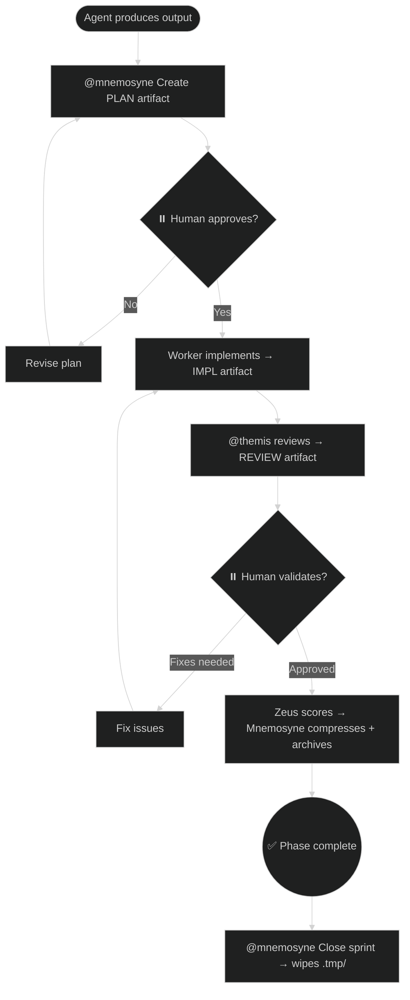

# Artifact Protocol

This instruction defines how agents produce and consume **structured artifacts**.

---

## Core Concept: Temp Folder

All ephemeral artifacts (PLAN, IMPL, REVIEW, DISC) are written to **`.pantheon/memory-bank/.tmp/`** — a gitignored temporary folder that is automatically wiped:

- On `@mnemosyne Close sprint`
- On `@mnemosyne Clean tmp`
- Manually at any time

**This folder never gets committed to git.** It exists only during an active sprint.

Only **ADR artifacts** (`_notes/`) are permanent and committed.

```
.pantheon/memory-bank/
├── .tmp/                  ← GITIGNORED — ephemeral artifacts live here
│   ├── PLAN-<feature>.md
│   ├── IMPL-phase1-hermes.md
│   ├── IMPL-phase1-aphrodite.md
│   ├── IMPL-phase1-demeter.md
│   └── REVIEW-<feature>.md
├── _notes/                ← COMMITTED — permanent ADRs only
│   └── ADR-<topic>.md
├── 01-active-context.md   ← COMMITTED
└── 02-progress-log.md     ← COMMITTED
```

---

## Who Generates Artifacts?

**Any agent that produces a phase output generates its own artifact** — not only Zeus.

| Situation | Generating agent | Artifact |
|---|---|---|
| `@athena` plans (with or without Zeus) | **Athena** | `PLAN-<feature>.md` |
| `@hermes` / `@aphrodite` / `@demeter` implement | **The worker** | `IMPL-phase<N>-<agent>.md` |
| `@themis` reviews | **Themis** | `REVIEW-<feature>.md` |
| `@apollo` | **Apollo** | `DISC-<topic>.md` |
| `@any` agent via subtask | **The worker** | No artifact — returns `subtask_summary` inline |
| Architectural decision (any agent) | **Any → Mnemosyne** | `ADR-<topic>.md` (permanent) |
| Zeus (cognitive) → Mnemosyne (writer) | **Zeus → Mnemosyne** | `ZZ-phase<N>-context.md` — compressed context artifact |

> [!IMPORTANT]
> **Zeus does NOT generate artifacts.** He orchestrates agents that generate them.
> **`@apollo` direct** is chat-only discovery and does NOT generate artifacts.

---

## Artifact Types

| Prefix | Location | Ephemeral? | Produced by |
|---|---|---|---|
| `PLAN-` | `.tmp/` | ✅ Deleted on sprint close | Athena |
| `IMPL-` | `.tmp/` | ✅ Deleted on sprint close | Hermes / Aphrodite / Demeter |
| `REVIEW-` | `.tmp/` | ✅ Deleted on sprint close | Themis |
| `DISC-` | `.tmp/` | ✅ Deleted on sprint close | Apollo (delegated discovery) |
| `SUB-` (inline) | inline response | ✅ No persistence | Any agent (via subtask) |
| `ZZ-` | `.tmp/` | ✅ Deleted on sprint close | Zeus → Mnemosyne (compression) | Compressed phase context — priority-scored summaries passed to next phase |
| `ADR-` | `_notes/` | ❌ Permanent, never deleted | Any agent |

---

## Subtask Rule — No Artifact, No Themis

**Subtask** is a lightweight delegation mode for bounded, low-risk work. It deliberately **skips** the standard artifact lifecycle:

| Aspect | Subtask | Full Task |
|--------|---------|-----------|
| Artifact | ❌ No artifact | ✅ IMPL- artifact |
| Themis review | ❌ No review | ✅ Mandatory review |
| Gate | ❌ No gate | ✅ Phase Review Gate |
| Return format | `subtask_summary` (structured) | Free-form response |
| When to use | Apollo investigation, Talos hotfix, bounded test run | Feature implementation, schema changes, security-sensitive work |

### Safety Rule

Subtask is ONLY appropriate when ALL these conditions are met:
1. **Bounded scope** — single file, < 10 lines changed, or read-only investigation
2. **Low risk** — no security implications, no data loss risk, no breaking changes
3. **No Themis dependency** — the output does not feed into a phase that requires review

If ANY condition is violated, use full `task()` delegation with artifact tracking.

### Examples

| ✅ Good subtask | ❌ Bad subtask |
|----------------|----------------|
| `subtask(apollo, "Find all auth route files")` | `subtask(hermes, "Implement login endpoint")` — needs Themis |
| `subtask(talos, "Fix typo in button CSS")` | `subtask(demeter, "Write user migration")` — needs rollback plan |
| `subtask(hermes, "Run tests and report")` | `subtask(prometheus, "Update Dockerfile")` — infrastructure risk |

---

## How to Create an Artifact

Agent calls Mnemosyne to write to `.tmp/`:

```
@mnemosyne Create artifact: PLAN-<feature> with the following content:
[plan content here]
```

Mnemosyne writes `.pantheon/memory-bank/.tmp/PLAN-<feature>.md`.

---

## Artifact Lifecycle



---

## Artifact Templates

### PLAN (Athena → `.tmp/`)

```markdown
# PLAN-<feature>
**Date:** YYYY-MM-DD  **Status:** Awaiting Approval

## Goal
[One sentence]

## Phases
1. Phase 1 — @hermes
2. Phase 2 — @aphrodite (parallel)
3. Phase 3 — @demeter

## Risks
- [Risk]

## Open Questions (requires your judgment)
- [ ] [Question]
```

### IMPL (Worker → `.tmp/`)

```markdown
# IMPL-<phase>-<agent>
**Date:** YYYY-MM-DD  **Status:** Awaiting Themis Review

## What Was Implemented
- [file] — [what changed]

## Tests
- ✅ X tests / Coverage: Y%

## Notes for Themis
[Area needing extra scrutiny]
```

### REVIEW (Themis → `.tmp/`)

```markdown
# REVIEW-<feature>
**Date:** YYYY-MM-DD  **Status:** APPROVED | NEEDS_REVISION | FAILED

## Verdict
[APPROVED | NEEDS_REVISION | FAILED]

## Issues
- CRITICAL: X / HIGH: Y / MEDIUM: Z

## 🔍 Human Review Focus (requires your judgment)
1. [Item AI cannot fully validate]
2. [Item 2]
```

### DISC (Apollo → `.tmp/`)

```markdown
# DISC-<topic>
**Date:** YYYY-MM-DD  **Status:** AWAITING_APPROVAL

## Question
[The original question]

## Specialist Perspectives
[Table: Agent | Position | Reasoning | Trade-offs | Risks | Confidence]

## Agreements
[Where 2+ agents converged]

## Divergences
[Table: Issue | Position A | Position B | Resolution]

## Decision Log
[Table: Decision | Chosen | Rejected Alternatives | Trade-off | Trigger to Revert]

## Recommendation
[Decisive conclusion]

## Decision Gate
**Status:** AWAITING_APPROVAL
Choose: **APPROVE** | **REQUEST CHANGES** | **DISCARD**
```

---

## Human Pause Points

1. **After DISC** → user reads `.tmp/DISC-<topic>.md` and chooses APPROVE / REQUEST CHANGES / DISCARD
2. **After PLAN** → user reads `.tmp/PLAN-<feature>.md` and approves
3. **After REVIEW** → user reads `.tmp/REVIEW-<feature>.md` and validates Human Review Focus items
4. **Before git commit** → user executes manually

---

## Parallel Execution Declaration

```
🔀 PARALLEL EXECUTION — Phase 2
Running simultaneously:
- @hermes   → backend tests   → .tmp/IMPL-phase2-hermes.md
- @aphrodite → frontend       → .tmp/IMPL-phase2-aphrodite.md
- @demeter     → migrations      → .tmp/IMPL-phase2-demeter.md
Themis reviews all three after completion.
```

---

## Archive Step — Context Compression

After Themis APPROVES a phase, the compression pipeline fires:

1. **Zeus validates**: Themis verdict is APPROVED, no blockers active
2. **Zeus scores**: Priority scores each subtask_summary (deterministic, no LLM)
3. **Zeus summarizes**: Generates semantic summaries for CRITICAL/HIGH entries
4. **Zeus budgets**: Runs priority-greedy budget allocation
5. **Zeus delegates**: Sends `compress_context` handoff to Mnemosyne
6. **Mnemosyne scrubs**: Runs `scripts/scrub-secrets.py` on any free-text
7. **Mnemosyne writes ZZ artifact**: `ZZ-phase{N}-context.md` in .tmp/
8. **Mnemosyne updates**: 01-active-context.md with priority-aware compressed entries
9. **Mnemosyne archives**: IMPL → 02-progress-log.md
10. **Mnemosyne cross-refs**: Updates _xref/index.md, increments _next_id.json
11. **Mnemosyne cleans**: Deletes archived artifacts from `.tmp/`
12. **Zeus injects**: ZZ artifact into next phase agent prompts

### Safety
- NEVER archive REVIEW with NEEDS_REVISION or FAILED
- NEVER compress subtask_summary with in_progress/escalated/blocked status
- NEVER touch ADR notes (`_notes/` — permanent)
- PLAN artifacts compress only after the LAST phase of a feature completes

### Rollback
Git preserves all pre-compression state. Recovery:
```bash
git show HEAD~1:.pantheon/memory-bank/01-active-context.md
```

### Write Protocol
All writes to `01-active-context.md` and `02-progress-log.md` use atomic write:
1. Write to `.tmp` file in same directory
2. `fsync()` the file descriptor
3. Validate minimum structure (>0 bytes, has heading)
4. `os.rename(.tmp, target)` — POSIX atomic on same filesystem

---

## Cleanup Commands

```
# Wipe .tmp/ entirely (sprint close)
@mnemosyne Close sprint: [summary]

# Wipe .tmp/ without closing sprint
@mnemosyne Clean tmp

# Check what's in .tmp/
@mnemosyne List artifacts
```

---

**Reference:** `instructions/artifact-protocol.instructions.md`
