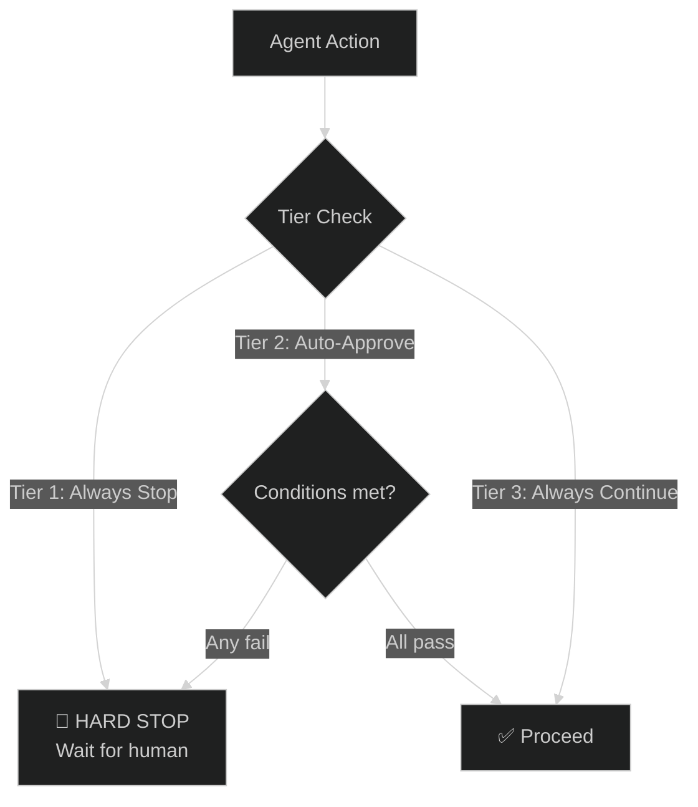

# Auto-Continue Safety Gates

## Overview

Three-tier safety system that determines what an agent can do autonomously vs. what requires human approval. Extends the gate system from `skills/auto-continue/SKILL.md` with explicit per-agent policies and enforcement rules.



## Gate Architecture

### Tier 1 — ALWAYS STOP (Human mandatory)
Operations that require explicit human approval before proceeding. The agent must stop, present the decision, and wait for confirmation.

```
  ├── Plan approval (GATE 1)
  ├── Git commit (GATE 3)
  ├── Council synthesis (GATE 0)
  ├── Production deploy
  ├── Destructive operations (DROP TABLE, DELETE, DROP COLUMN, TRUNCATE)
  ├── New agent creation or agent config change
  ├── Permission/security policy changes
  ├── API key or credential changes
  └── Any action not covered by the approved plan scope
```

### Tier 2 — AUTO-APPROVE WITH LIMITS (Configurable)
Operations that proceed automatically only when all conditions are met. If any condition fails, the gate escalates to Tier 1 behavior.

```
  ├── Themis review with no CRITICAL/HIGH issues
  ├── Test suites with 100% pass rate
  ├── Coverage ≥80%
  ├── Phase transitions within approved plan
  ├── Parallel agent dispatch (within plan scope)
  ├── Migration upgrade+downgrade (both tested)
  └── Background agent result integration
```

**Auto-approve conditions (ALL must pass):**
1. No CRITICAL or HIGH severity issues in the output
2. All tests pass (100%)
3. Coverage meets minimum threshold (≥80%)
4. Action stays within approved plan scope
5. No new ambiguity or unresolved blockers
6. Gate decision is logged to checkpoint

### Tier 3 — ALWAYS CONTINUE (No gate)
Operations that proceed without any gate. These are safe, reversible, or purely mechanical actions.

```
  ├── TDD cycles (RED→GREEN→REFACTOR)
  ├── File edits within scope
  ├── Test runs (any suite)
  ├── Lint/format auto-fixes
  ├── Checkpoint saves
  ├── File reads and codebase searches
  ├── Todo list updates
  └── Cooldown synthesis summaries
```

## Gate Configuration

Each agent declares its gate policy in its agent definition. The configuration uses three gate modes:

| Mode | Behavior | When to use |
|------|----------|-------------|
| `always_stop` | Hard stop, wait for human | Irreversible or high-impact actions |
| `auto_approve` | Proceed if conditions met | Routine actions within plan scope |
| `always_continue` | Never gate | Safe, reversible, mechanical actions |

**Configuration format:**

```yaml
auto-continue:
  gates:
    plan_approval: always_stop        # Tier 1
    themis_review: auto_approve       # Tier 2 — only if all pass
    git_commit: never_auto            # Tier 1 — git is always manual
    phase_transition: auto_approve    # Tier 2 — within plan scope
    tdd_cycle: always_continue        # Tier 3
    deploy: always_stop               # Tier 1
    agent_dispatch: auto_approve      # Tier 2 — within plan scope
    destructive_db: always_stop       # Tier 1
    config_change: always_stop        # Tier 1
```

## Agent Safety Profile

### Full 14-Agent Profile

| Agent | Tier 1 Gates | Tier 2 Gates | Tier 3 Actions |
|-------|-------------|-------------|----------------|
| **Zeus** | plan, commit, deploy, council, config_change | themis_review, phase_transition, agent_dispatch | tdd_cycle, dispatch (non-blocking), checkpoint, cooldown |
| **Hermes** | commit, destructive_db | themis_review, phase_transition | tdd_cycle, file_edits, test_runs, lint_format |
| **Aphrodite** | commit | themis_review, phase_transition | tdd_cycle, file_edits, test_runs, visual_review |
| **Demeter** | commit, migration, destructive_db | themis_review, phase_transition | tdd_cycle, schema_read, migration_test |
| **Apollo** | none (read-only) | none | search, explore, read, codemap |
| **Themis** | verdict, audit | quality_checks, recall | lint, format, grep, pytest, pip-audit |
| **Athena** | plan, council | research | analysis, codemap, interview |
| **Talos** | none (hotfix — <10 lines) | escalation | single_edit, test_run |
| **Prometheus** | deploy, config_change | build, package | test, lint, docker_build |
| **Hephaestus** | deploy, config_change | pipeline, review | build, test, package |
| **Iris** | push, merge | pr_create | list, read, branch |
| **Nyx** | config_change | metrics | read, report, observe |
| **Mnemosyne** | destructive_ops (memory wipe) | memory_write | read, index, search, recall |
| **Gaia** | none (read-only) | pipeline | process, analyze, search |

### Profile Rules

1. **Read-only agents (Apollo, Gaia):** No Tier 1 gates — they cannot modify anything
2. **Hotfix agent (Talos):** Tier 1 only for escalation — single-edit hotfixes skip gates
3. **Reviewer (Themis):** Verdict and audit are always Tier 1 — human sees results before action
4. **Orchestrator (Zeus):** Plan, commit, deploy, and council are always Tier 1 — these are decision points
5. **Memory agent (Mnemosyne):** Destructive operations (memory wipe, namespace delete) are Tier 1

## Safety Enforcement

Themis enforces these rules during review:

### 1. Gate Violations
Any code or behavior that bypasses a Tier 1 gate:
- **Severity: CRITICAL** — block review, require fix
- Examples: auto-committing, auto-deploying, skipping plan approval

### 2. Missing Gates
Any operation that should be gated but isn't:
- **Severity: HIGH** — add the missing gate
- Examples: database migration without rollback gate, config change without approval

### 3. Auto-Approve with Failures
Auto-approve used when conditions are not met:
- **Severity: CRITICAL** — remove auto-approve, require conditions to pass
- Examples: approving Themis review despite CRITICAL issues, approving phase transition with failing tests

### 4. Gate Not Logged
Gate decision not recorded in checkpoint:
- **Severity: MEDIUM** — add gate logging
- Examples: no checkpoint save before phase transition, missing gate_history entry

### 5. Unclear Gate Policy
Agent's gate configuration is ambiguous or incomplete:
- **Severity: LOW** — document the gate policy
- Examples: missing gate config for deploy, unclear whether destructive_db is gated

### Severity Summary

| Violation | Severity | Action |
|-----------|----------|--------|
| Bypassed Tier 1 gate | CRITICAL | Block review, require fix |
| Auto-approve with failures | CRITICAL | Revert to always_stop |
| Missing gate on dangerous op | HIGH | Add gate configuration |
| Gate not logged to checkpoint | MEDIUM | Add checkpoint gate logging |
| Unclear gate policy | LOW | Document gate policy |

## Checkpoint Persistence

Before any delegate dispatch or phase transition, the agent MUST save a checkpoint:

### Checkpoint Format
```json
{
  "checkpoint_id": "cp-<timestamp>",
  "session_id": "<session>",
  "phase": "<current phase>",
  "completed_todos": ["todo1", "todo2"],
  "pending_todos": ["todo3", "todo4"],
  "gate_history": [
    {"gate": "plan_approval", "decision": "approved", "timestamp": "<iso>"},
    {"gate": "themis_review", "decision": "auto_approved", "timestamp": "<iso>", "conditions": {"tests_pass": true, "coverage": 87, "no_high_issues": true}}
  ],
  "artifacts": ["IMPL-phase1-hermes.md"]
}
```

### Checkpoint Rules
1. **Before delegation** — save checkpoint with current state
2. **Before phase transition** — save checkpoint with gate_history
3. **Every 5 turns** — save heartbeat checkpoint
4. **On gate decision** — append to gate_history immediately

## Idle Detection Sequence

When no agent activity is detected, follow this escalation:

```
No tool call for 60s → log heartbeat warning (status: warning)
No tool call for 120s → trigger anti-stall protocol
No tool call for 300s → auto-save checkpoint and pause session
Resume requires user acknowledgment
```

Reference: `instructions/zeus-anti-stall.instructions.md` for stall recovery actions.

## Platform Compatibility

### Gate Behavior by Platform

| Platform | Tier 1 Support | Tier 2 Support | Background Dispatch | Notes |
|----------|---------------|----------------|---------------------|-------|
| **OpenCode** | ✅ Full | ✅ Full | ✅ v1.16.2+ (task background) | Native auto-continue with session snapshots |
| **Copilot (VS Code)** | ✅ Full | ✅ Full | ❌ No background | All gates explicit, no background dispatch |
| **Cursor** | ✅ Full | ✅ Partial | ❌ No background | No web fetch, all gates explicit |
| **Windsurf** | ✅ Full | ✅ Partial | ❌ No background | No web fetch, all gates explicit |
| **Continue.dev** | ✅ Full | ✅ Full | ❌ No background | Web fetch available |
| **Copilot CLI** | ⚠️ Limited | ❌ No | ⚠️ Limited | No agent delegation — use task commands |

### Platform-Specific Rules
- **OpenCode only:** Background dispatch enabled (v1.16.2+). Tier 2 auto-approve for independent parallel tasks.
- **All platforms:** Tier 1 always_stop gates are platform-independent — human must respond.
- **No background platforms:** Sequential dispatch only. No Tier 2 auto-approve for parallel work.

## Relationship to Existing Gates

This safety gate system builds on and extends the existing 4-gate system from `skills/auto-continue/SKILL.md`:

| Existing Gate (Skill) | Safety Tier | Notes |
|-----------------------|-------------|-------|
| GATE 0 — Agora Council | Tier 1 | Always stop |
| GATE 1 — Plan Approval | Tier 1 | Always stop |
| GATE 2 — Phase Review (Themis) | Tier 2 | Auto-approve when conditions met |
| GATE 3 — Git Commit | Tier 1 | Always stop (git is never auto) |

New gates added by this system:
- Production deploy → Tier 1
- Destructive DB operations → Tier 1
- Config changes → Tier 1
- Agent dispatch → Tier 2 (within plan scope)
- TDD cycles → Tier 3 (no gate)
- File edits → Tier 3 (no gate)
- Test runs → Tier 3 (no gate)

## Quick Reference

```
Tier 1 (ALWAYS STOP):  plan, commit, deploy, council, destructive_db, config_change
Tier 2 (AUTO-APPROVE): themis_review, phase_transition, agent_dispatch, memory_write
Tier 3 (CONTINUE):     tdd_cycle, file_edits, test_runs, lint_format, checkpoint, search
```

**For implementers:** If unsure whether an action needs a gate, default to Tier 1 (always_stop). It's safer to pause unnecessarily than to skip a required gate.
