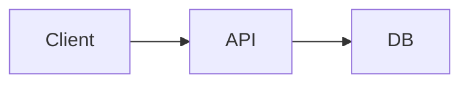

# Plan Architecture

Produce a thorough architecture plan before writing any code.

## When to Use

- New feature with unclear structure
- Cross-cutting concern (auth, caching, async processing)
- System integration (webhook handler, background job, external API)
- Any task labeled `architecture`, `design`, `spike`

## Output Structure

```
## Components
- component-name: responsibility, public API (methods/signals)

## Data Flow
1. entrypoint → ...
2. ... → datastore
3. cleanup/GC path

## API Contracts
### Endpoint / Method
- Request: {shape}
- Response: {shape}
- Errors: {code: reason}

## Technology Choices
| Component | Choice | Rationale |
|---|---|---|
| DB | SQLite | Zero-config, embedded |
| HTTP | httpx | Async, streaming |

## Diagram (optional, Mermaid)

